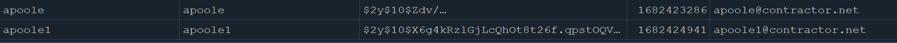
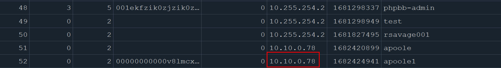
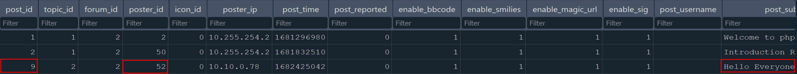
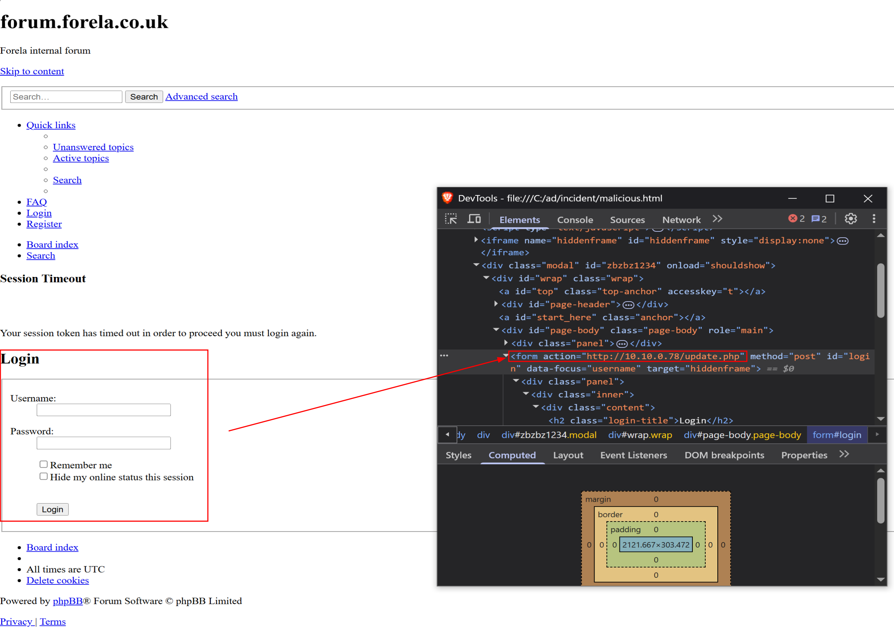
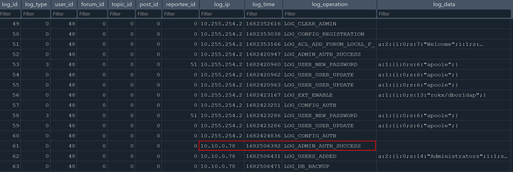
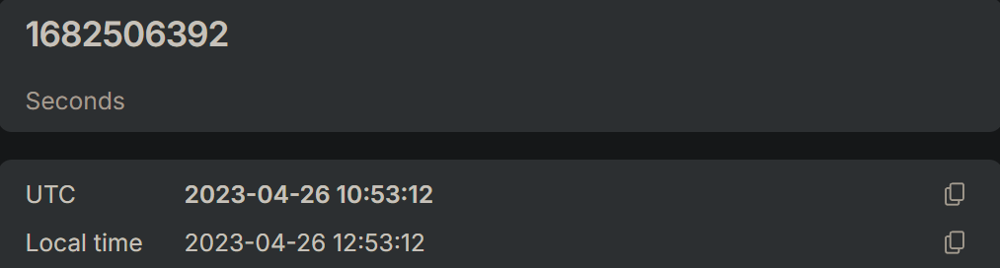
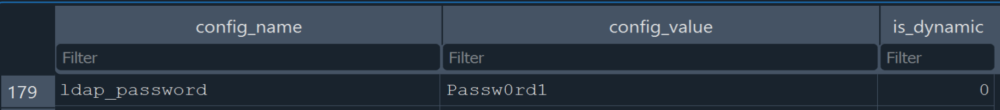
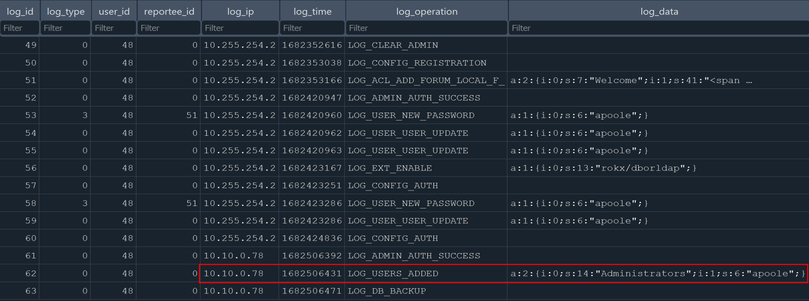
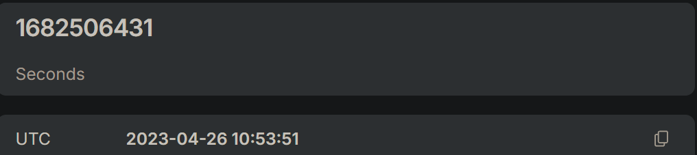

---
tags:
  - htb
  - sherlock
  - easy
  - post
urls:
---
---
# HTB Sherlock - Bumblebee Writeup

> **Scenario:** An external contractor has accessed the internal forum here at Forela via the Guest Wi-Fi, and they appear to have stolen credentials for the administrative user! We have attached some logs from the forum and a full database dump in sqlite3 format to help you in your investigation.

# QUESTIONS

1. What was the username of the external contractor?

**Answer:** `apoole1`

Inside the `phpbb_users` table from the provided `phpbb.sqlite3` database, there are two possible users that might belong to the contractor:



2. What IP address did the contractor use to create their account?

**Answer:** `10.10.0.78`

In the same table the IP from which the contractor created their account is visible:



3. What is the post_id of the malicious post that the contractor made?

**Answer:** `9`

phpbb_posts

From the `phpbb_posts` table, the contractor with `poster_id` 52 made the malicious phishing HTML post with `post_id` 9:



4. What is the full URI that the credential stealer sends its data to?

**Answer:** `http://10.10.0.78/update.php`

The malicious HTML post is a fake login page that contains a login form pointing to `http://10.10.0.78/update.php`



5. When did the contractor log into the forum as the administrator? (UTC)

**Answer:** `26/04/2023 10:53:12`

Looking at the `phpbb_log` table, the contractor authenticated as administrator from the IP used to create the same account:



A quick epoch to UTC time converter returns the time of authentication:



6. In the forum there are plaintext credentials for the LDAP connection, what is the password?

**Answer:** `Pasw0rd1`

Investigating the `phpbb_config` table, at row 172 `ldap_password` the value is shown in clear text:



7. What is the user agent of the Administrator user?

**Answer:** `Mozilla/5.0 (Macintosh; Intel Mac OS X 10_15_7) AppleWebKit/537.36 (KHTML, like Gecko) Chrome/112.0.0.0 Safari/537.36`

The administrator's IP from where the account was created is `10.255.254.2`, looking at the provided `access.log`, the user agent is easy to discern:

```
10.255.254.2 - - [25/Apr/2023:12:45:45 +0100] "GET /adm/index.php?sid=041ca559047513ba2267dfc066187582&i=21 HTTP/1.1" 200 3483 "http://10.10.0.27/adm/index.php?i=acp_users&sid=041ca559047513ba2267dfc066187582&mode=overview&u=51" "Mozilla/5.0 (Macintosh; Intel Mac OS X 10_15_7) AppleWebKit/537.36 (KHTML, like Gecko) Chrome/112.0.0.0 Safari/537.36"
```

8. What time did the contractor add themselves to the Administrator group? (UTC)

**Answer:** `26/04/2023 10:53:51`

Back to the `phpbb_log` table, the contractor added the user `apoole` to the Administrator group:



Epoch to UTC:



9. What time did the contractor download the database backup? (UTC)

From the `access.log` file, there is a `GET` request to the `/store` path, where database backups are stored:

**Answer:** `26/04/2023 11:01:38`

```
10.10.0.78 - - [26/Apr/2023:12:01:38 +0100] "GET /store/backup_1682506471_dcsr71p7fyijoyq8.sql.gz HTTP/1.1" 200 34707 "-" "Mozilla/5.0 (Windows NT 10.0; Win64; x64; rv:109.0) Gecko/20100101 Firefox/112.0"
```

Again, the logs are stored as UTC+01.

10. What was the size in bytes of the database backup as stated by access.log?

**Answer:** `34707`

The previous log provides the size.