---
tags:
  - htb
  - sherlock
  - easy
  - post
urls:
---
---
# HTB Sherlock - Cuidado Writeup

> **Scenario:** Recently, a user triggered multiple alerts after downloading several potentially unwanted applications (PUAs), prompting concern from the security team. To gain deeper insight into the user's activity, the team began monitoring network traffic from their workstation. Their objective is to assess whether the downloads are linked to more serious malware threats.

# QUESTIONS

1. What is the victim's IP address?

**Answer:** `192.168.1.152`

Looking at the provided `.pcap` network capture conversations, the IPs `192.168.1.152` and `94.156.177.109` have over 2MB of HTTP data:

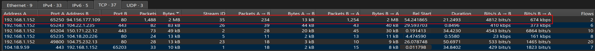

Checking the frames of the conversation shows 4 `GET` requests:

```
ip.addr==192.168.1.152 && ip.addr==94.156.177.109 && http
```

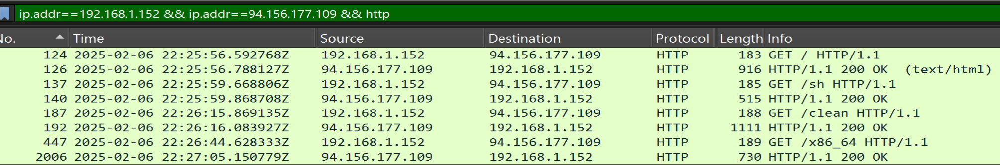

Following the `HTTP` stream of the frame 137 with the petition to `/sh` reveals malicious content:

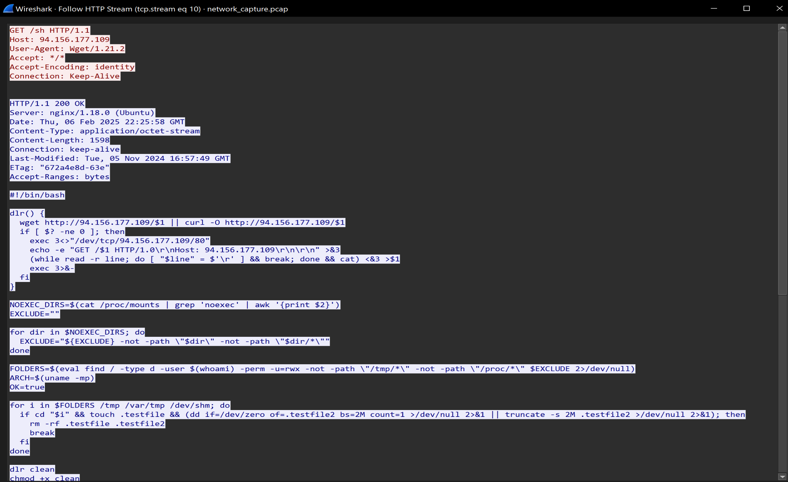

2. What is the IP address of the attacker from whom the files were downloaded?

**Answer:** `94.156.177.109`

The petition comes from `94.156.177.109`:

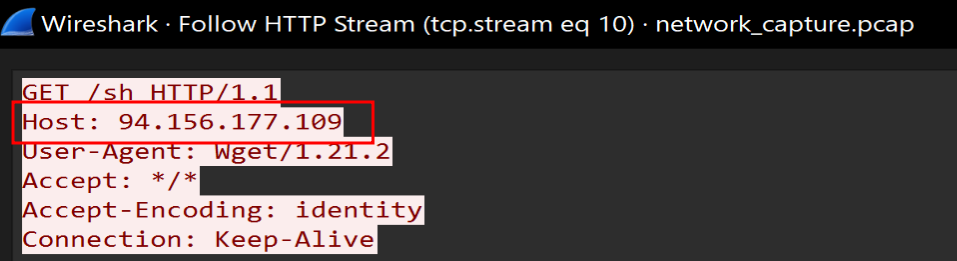

3. Which malicious file appears to be the first one downloaded?

**Answer:** `sh`

4. What is the name of the function that the attacker used to download the payload?

**Answer:** `dlr`

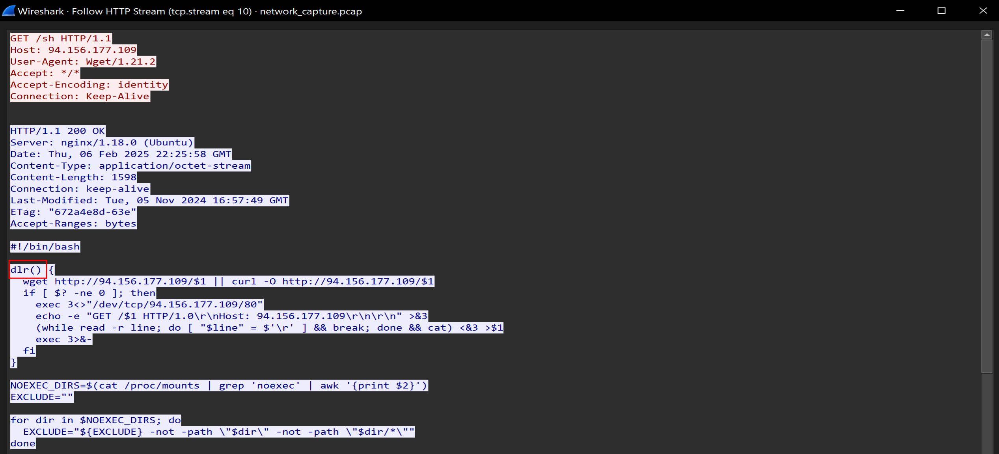

5. Which port does the attacker's server use?

**Answer:** `80`

The reverse shell makes use of the port `80`:

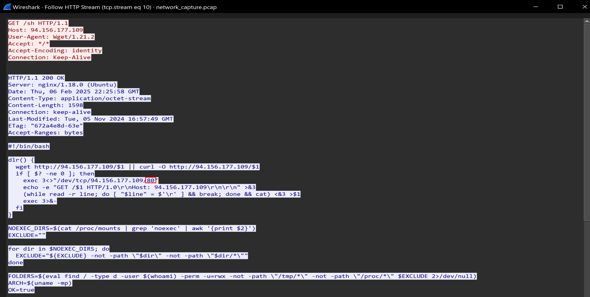

6. The script checks which directories it can write to by attempting to create test files. What is the size of the second test file? (Size in MB)

**Answer:** `2`

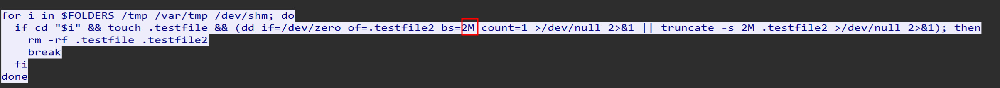

7. What is the full command that the script uses to identify the CPU architecture?

**Answer:** `uname -mp`

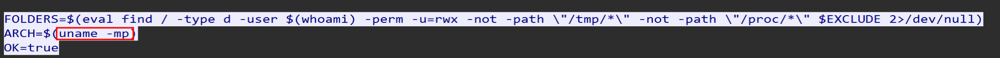

8. What is the name of the file that is downloaded after the CPU architecture is compared with reference values?

**Answer:** `x86_64`

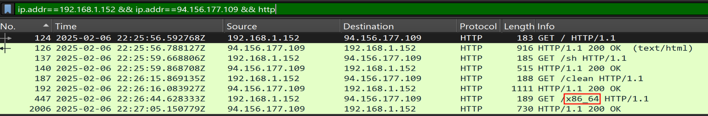

9. What is the full command that the attacker used to disable any existing mining service?

**Answer:** `systemctl disable c3pool_miner`

The `HTTP` stream of the `/clean` petitions shows the attacker tried disabling any existing Monero miner:

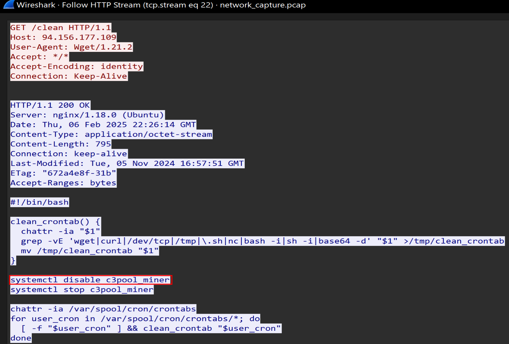


10. Apparently, the attacker used a packer to compress the malware. Which version of this packer was used? (Format X.XX)

**Answer:** `4.23`

The `x86_64` `GET` petitions holds the malware, using the `HTTP` export object list allows the retrieval of the file:

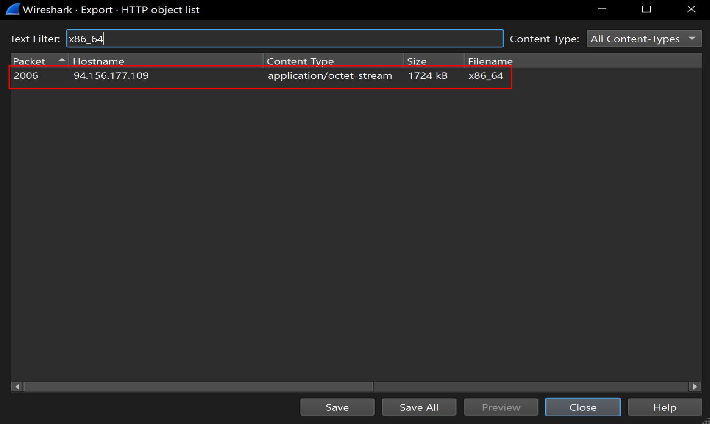

Calculating the `SHA256` hash of the file to later upload to VirusTotal:

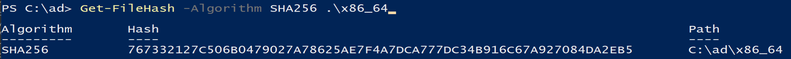

Revealing the used `upx` packer:

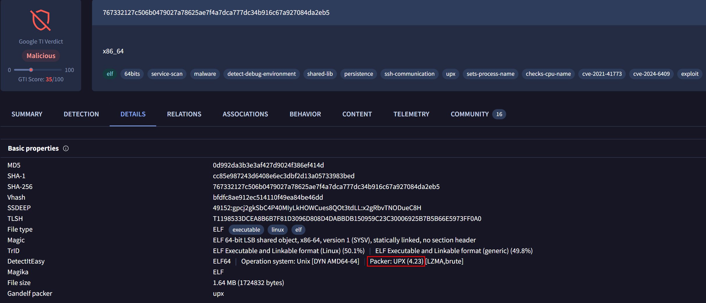


11. What is the entropy value of unpacked malware?

**Answer:** `6.488449`

Unpacking the malware using the `upx` tool:

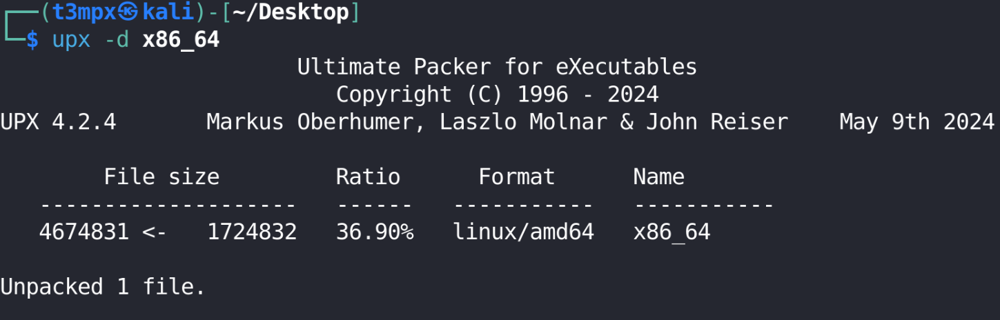

Calculating the entropy:

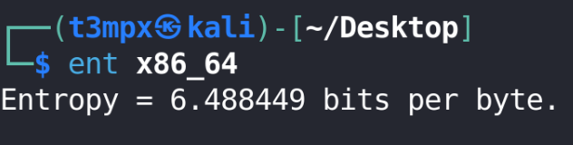

11. What is the file name with which the unpacked malware was submitted on VirusTotal for the first time?

**Answer:** `redtail.cuidado`

The `Names` section inside `Details` show all the names the malware was uploaded with: 

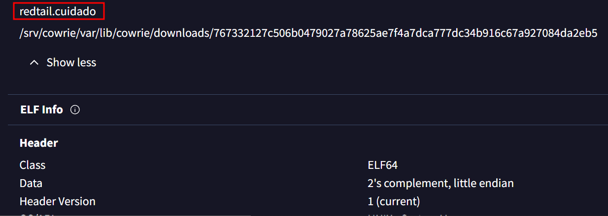

12. What MITRE ATT&CK technique ID is associated with the main purpose of the malware?

**Answer:** `T1496`

A quick Google search returns the answer:

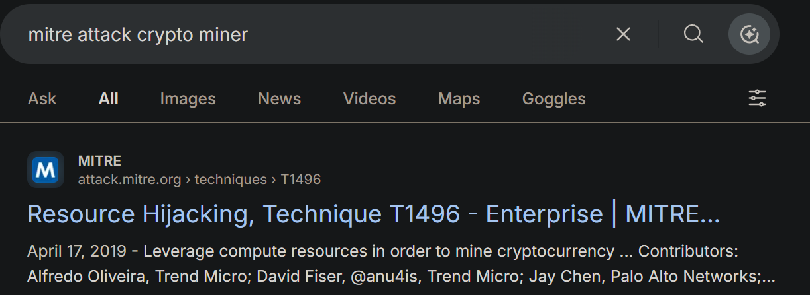