---
tags:
  - htb
  - sherlock
  - easy
  - post
urls:
---
---
# HTB Sherlock - Hyperfiletable Writeup

> **Scenario:** There has been a new joiner in Forela, they have downloaded their onboarding documentation, however someone has managed to phish the user with a malicious attachment. We have only managed to pull the MFT record for the new user, are you able to triage this information?

# QUESTIONS

1. What is the MD5 hash of the MFT?

**Answer:** `3730C2FEDCDC3ECD9B83CBEA08373226`

A quick `Get-FileHash` provides the file hash:

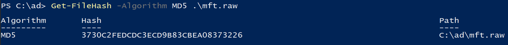

2. What is the name of the only user on the system?

**Answer:** `Randy Savage`

Loading the `MFT` provided using `MFT Explorer` and navigating to the `Users` folders reveal the only user on the system:

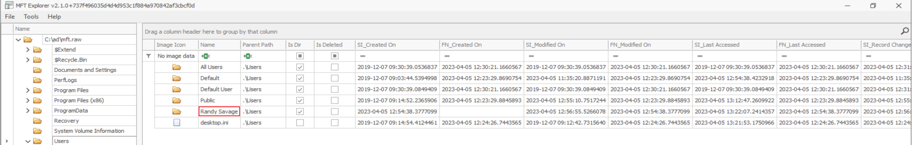

3. What is the name of the malicious HTA that was downloaded by that user?

**Answer:** `Onboarding.hta`

Moving to the user's download folder shows the malicious `HTA` file:

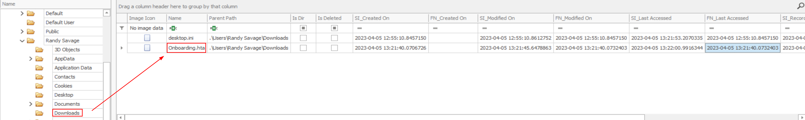

4. What is the ZoneId of the download for the malicious HTA file?

**Answer:** `3`

The `ZoneId` indicates that the file was downloaded from the internet:

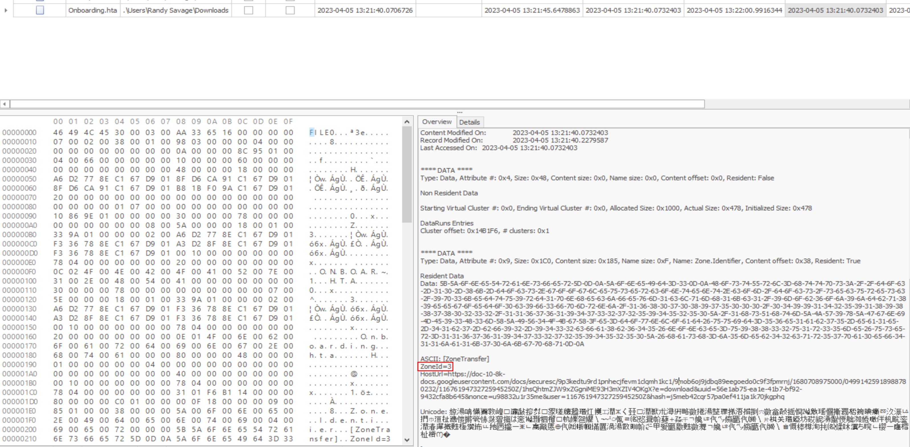

5. What is the download URL for the malicious HTA?

**Answer:** `https://doc-10-8k-docs.googleusercontent.com/docs/securesc/9p3kedtu9rd1pnhecjfevm1clqmh1kc1/9mob6oj9jdbq89eegoedo0c9f3fpmrnj/1680708975000/04991425918988780232/11676194732725945250Z/1hsQhtmZJW9xZGgniME93H3mXZIV4OKgX?e=download&uuid=56e1ab75-ea1e-41b7-bf92-9432cfa8b645&nonce=u98832u1r35me&user=11676194732725945250Z&hash=j5meb42cqr57pa0ef411ja1k70jkgphq`

The `HostUrl` points to the URl where the file was downloaded from:

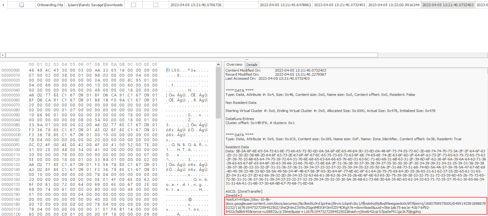

6. What is the allocated size for the HTA file? (bytes)

**Answer:** `4096`

The allocated size is `0x1000` hex bytes:

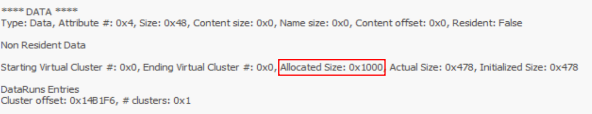

Converted to decimal:

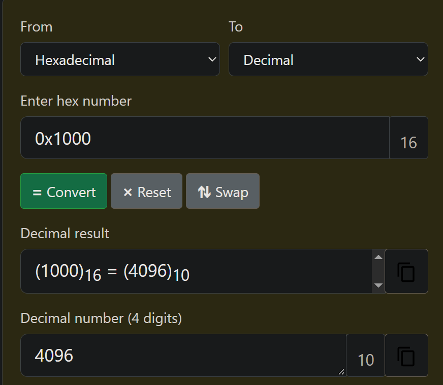

7. What is the real size of the HTA file? (bytes)

**Answer:** `1144`

The real size is `0x478` hex bytes:

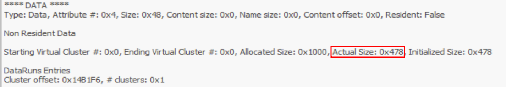

Converted to decimal:

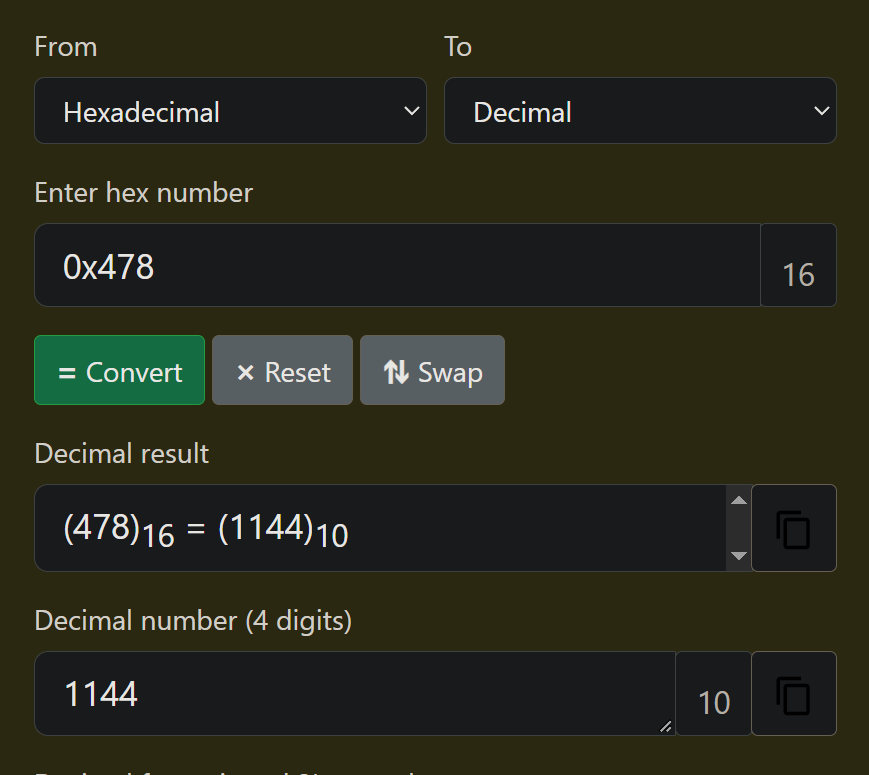

8. When was the powerpoint presentation downloaded by the user?

**Answer:** `05/04/2023 13:11:49`

Inside the `Work` subfolder of `Documents`, the `Proposal.pptx` powerpoint is present:

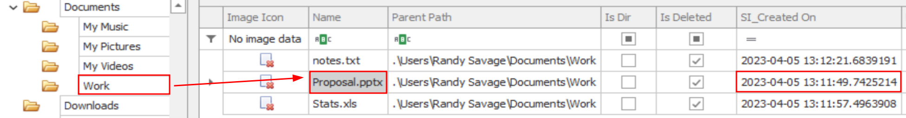

9. The user has made notes of their work credentials, what is their password?

**Answer:** `ReallyC00lDucks2023!`

The credentials are store in plaintext in the file `notes.txt`:

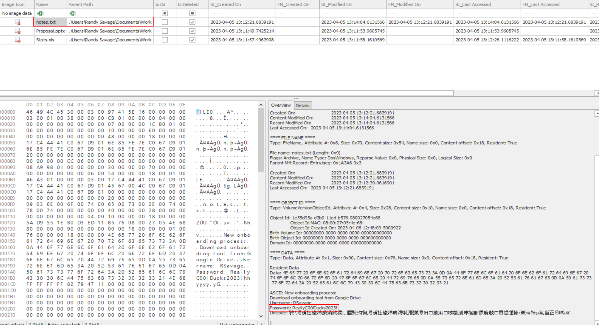


10. How many files remain under the C:\Users\ directory? (Recursively)

**Answer:** `3471`

Parsing the `MFT` table using `MFTECmd` for easier handling:

```
.\MFTECmd.exe -f C:\ad\mft.raw --csvf mft.csv
```

Loading the `.csv` file into `Timeline Explorer`, selecting the `In Use` box, filtering for the string `.\Users` in the Parent Path and deselecting the `Is Directory` and `Is Ads` boxes returns the total number of files inside all the folder in C:\Users\

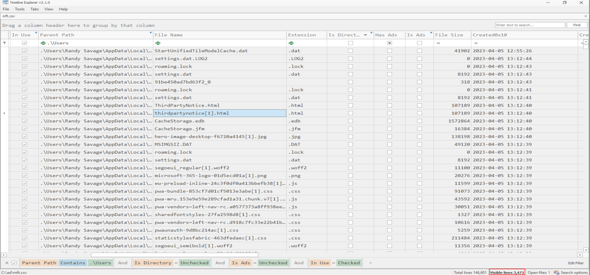