---
tags:
  - htb
  - sherlock
  - easy
  - post
urls:
---
---
# HTB Sherlock - Jingle Bell Writeup

> **Scenario:** Torrin is suspected to be an insider threat in Forela. He is believed to have leaked some data and removed certain applications from their workstation. They managed to bypass some controls and installed unauthorised software. Despite the forensic team's efforts, no evidence of data leakage was found. As a senior incident responder, you have been tasked with investigating the incident to determine the conversation between the two parties involved.

# QUESTIONS

1. Which software/application did Torrin use to leak Forela's secrets?

**Answer:** `slack`

The `Windows Push Notification` service allows push notifications to be delivered to Windows

Inside the provided evidence path `Torrincase\C\Users\Appdata\Local\Microsoft\Windows\Notifications`, the database holding push notification information, `wpndatabase.db`, is present:

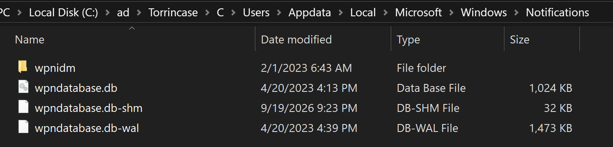

Opening the file with `DB Browser for SQLite` allows the reading of the information, the `Notification` table  mentions multiple `slack`:

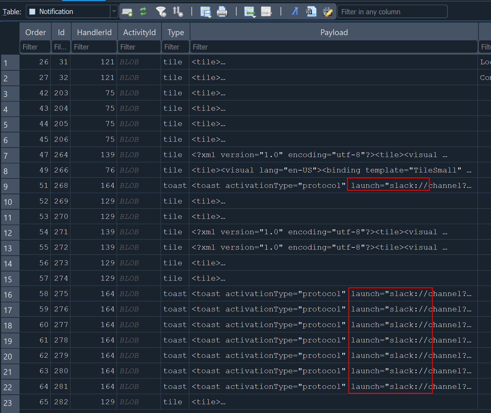

2. What's the name of the rival company to which Torrin leaked the data?

**Answer:** `PrimeTech Innovations`

The message with `Id` 268 holds the first instance of the rival company name:

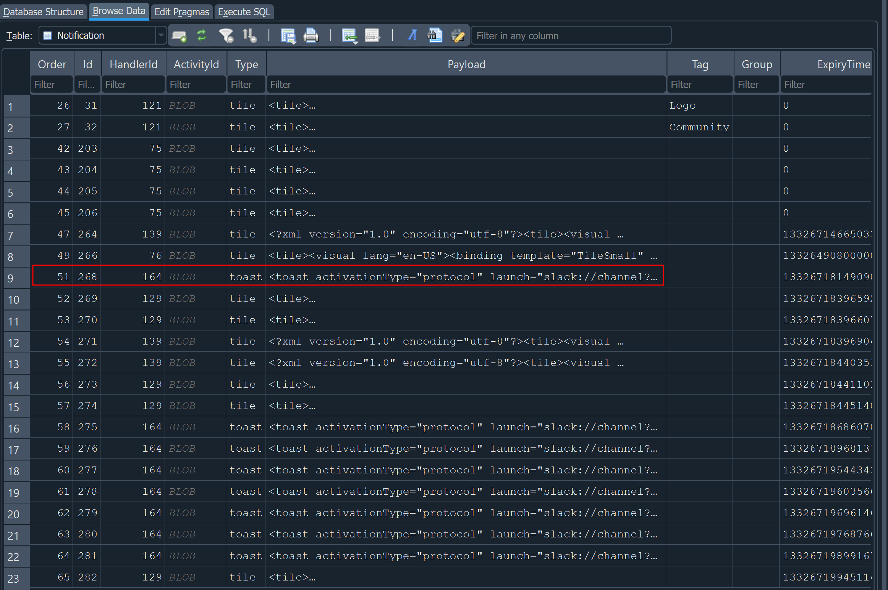

Beautifying the `Payload` reveals the name:

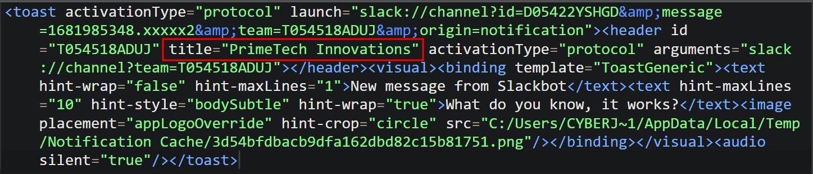

3. What is the username of the person from the competitor organization whom Torrin shared information with?

**Answer:** `Cyberjunkie-PrimeTechDev`

The message with `Id` 276 holds the first instance of the username, beautifying the `Payload` reveals it:

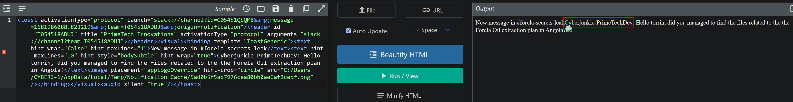

4. What's the channel name in which they conversed with each other?

**Answer:** `forela-secrets-leak`

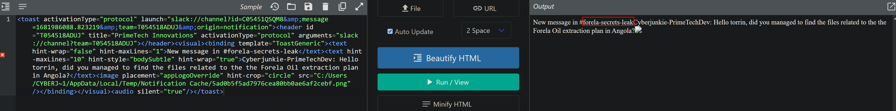

5. What was the password for the archive server?

**Answer:** `Tobdaf8Qip$re@1`

The message with `Id` 277 holds the password, beautifying the `Payload` reveals it:

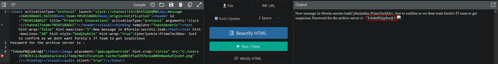

6. What was the URL provided to Torrin to upload stolen data to?

**Answer:** `https://drive.google.com/drive/folders/1vW97VBmxDZUIEuEUG64g5DLZvFP-Pdll?usp=sharing`

The message with `Id` 280 holds the URL, beautifying the `Payload` reveals it:

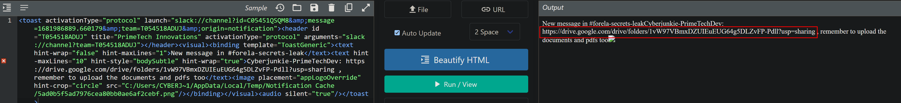

7. When was the above link shared with Torrin?

**Answer:** `2023-04-20 10:34:49`

The time is saved as epoch:

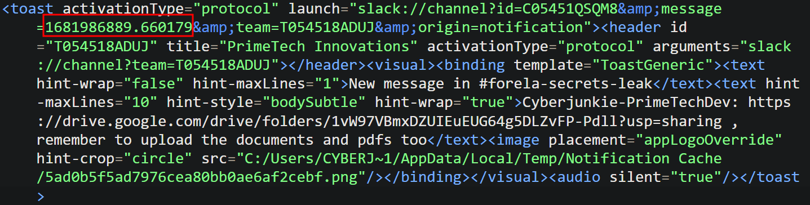

A quick conversion returns the UTC time:

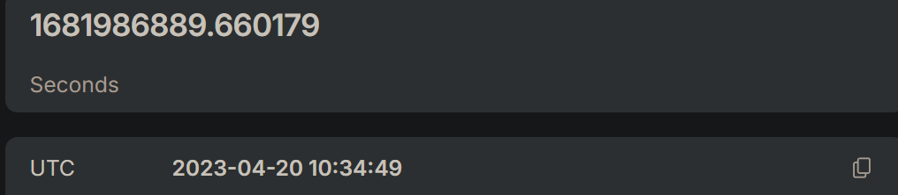

8. For how much money did Torrin leak Forela's secrets?

**Answer:** `£10000`

The message with `Id` 281 holds the payment, beautifying the `Payload` reveals it:

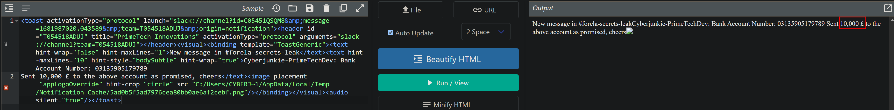