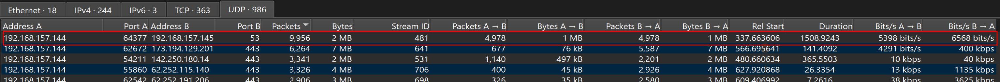
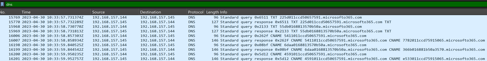

---
tags:
  - htb
  - sherlock
  - easy
  - post
urls:
---
---
# HTB Sherlock - Litter Writeup

> **Scenario:** Khalid has just logged onto a host that he and his team use as a testing host for many different purposes. It’s off their corporate network but has access to lots of resources on the network. The host is used as a dumping ground for a lot of people at the company, but it’s very useful, so no one has raised any issues. Little does Khalid know; the machine has been compromised and company information that should not have been on there has now been stolen – it’s up to you to figure out what has happened and what data has been taken.

# QUESTIONS

1. At a glance, what protocol seems to be suspect in this attack?

**Answer:** `DNS`

The conversations menu offers a view of all the network communication inside the provided `.pcap`, in this case the almost 10.000 `DNS` packets are suspicious:



Filtering for `dns` packets show multiple DNS queries to different, apparently, generated subdomains of `microsofto365.com`:



2. There seems to be a lot of traffic between our host and another, what is the IP address of the suspect host?

**Answer:** `192.168.157.145`

The almost 10.000 packets are being sent to the internal IP `192.168.157.145`:


3. What is the first command the attacker sends to the client?

**Answer:** `whoami`

The technique utilized appears to be hex encoded `DNS Tunneling`,  `tshark` allows the easy retrieval of all the DNS lookups:

```bash
tshark -r suspicious_traffic.pcap -Y 'ip.src == 192.168.157.145 && ip.dst == 192.168.157.144 && frame.len > 180' -T fields -e dns.qry.name | sed 's/\.microsofto365\.com//' > hex.txt
```

Then xxd reverses the `hex` encoding, returning the full reconstruction of :


4. What is the version of the DNS tunneling tool the attacker is using?

**Answer:** `0.07`

The attacker tries to execute the tool `dns.cat2-v0.07-client-win32.exe` but fails, the file is not present:


5. The attackers attempts to rename the tool they accidentally left on the clients host. What do they name it to?

**Answer:** `win_installer.exe`

The tool is renamed to `win_installer.exe`:


6. The attacker attempts to enumerate the users cloud storage. How many files do they locate in their cloud storage directory?

**Answer:** `0`

The cloud storage folder `OneDrive` is empty:


7. What is the full location of the PII file that was stolen?

**Answer:** `C:\Users\test\Documents\client data optimisation\user details.csv`

The full location is `C:\Users\test\Documents\client data optimisation\user details.csv`:


8. Exactly how many customer PII records were stolen?

**Answer:** `721`

The records go from 0 to 720:


