---
tags:
  - htb
  - sherlock
  - easy
  - post
urls:
---
---
# HTB Sherlock - OpTinselTrace-1 Writeup

> **Scenario:** An elf named "Elfin" has been acting rather suspiciously lately. He's been working at odd hours and seems to be bypassing some of Santa's security protocols. Santa's network of intelligence elves has told Santa that the Grinch got a little bit too tipsy on egg nog and made mention of an insider elf! Santa is very busy with his naughty and nice list, so he’s put you in charge of figuring this one out. Please audit Elfin’s workstation and email communications.

# QUESTIONS

1. What is the name of the email client that Elfin is using?

**Answer:** `em client`

Parsing the `SOFTWARE` registry with `RECcmd.exe` and the `InstalledSoftware.reb` batch shows the uninstall entries of installed programs:

```
.\RECmd.exe -f C:\ad\elfidence_collection\TriageData\C\Windows\system32\config\SOFTWARE --bn .\BatchExamples\InstalledSoftware.reb --csv C:\ad\elfidence_collection\TriageData\software --csvf software.csv
```

With the `.csv` file the email client is easy to spot:

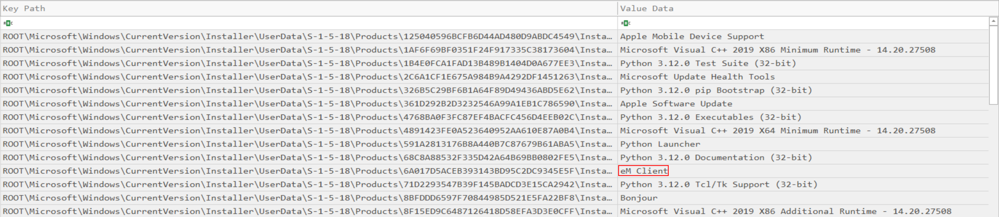

Alternatively, inside the `Roaming` folder, the installation is present:

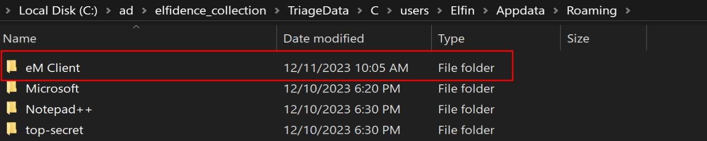

2. What is the email the threat is using?

**Answer:** `definitelynotthegrinch@gmail.com`

To load and read the content of the `eM Client` inside the evidence's `Roaming` folder, the client application must be installed.

In the `Storage` configuration from the `General` section of the application's `Settings`, change the default folder to the `Roaming` folder from the evidences folder, then restarting the client.:

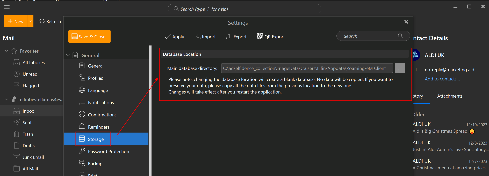

The threat actor email is shown to the right of the email:

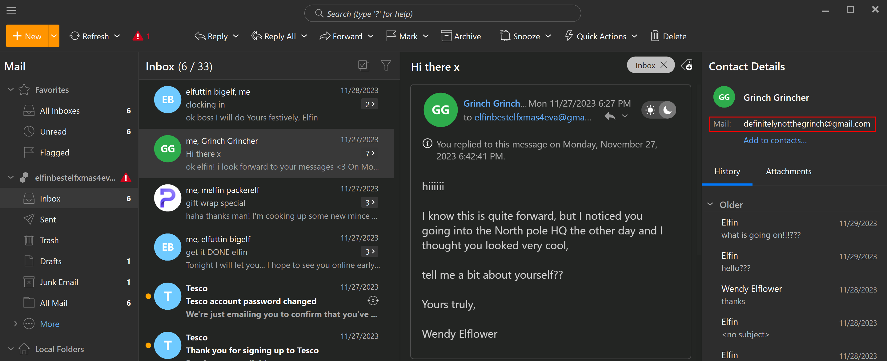

3. When does the threat actor reach out to Elfin?

**Answer:** `2023-11-27 17:27:26`

In the response message to the first sent by the threat actor, the sent time of the email is present:

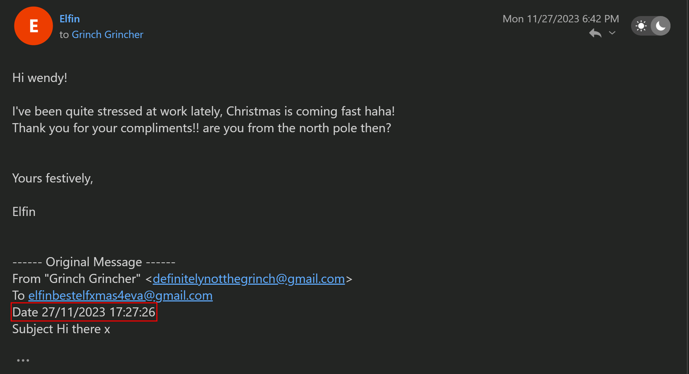


4. What is the name of Elfins boss?

**Answer:** `elfuttin bigelf`

Various emails coming from the boss are in the inbox:

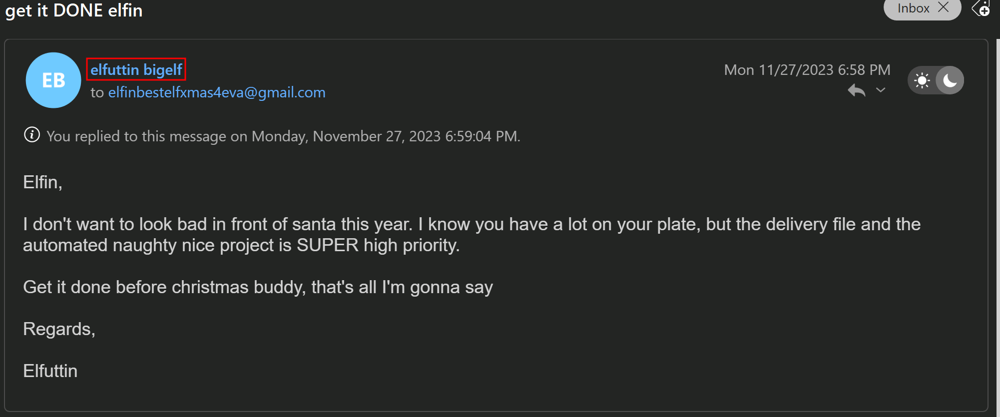

5. What is the title of the email in which Elfin first mentions his access to Santas special files?

**Answer:** `re: work`

The user replied to the `work` email:

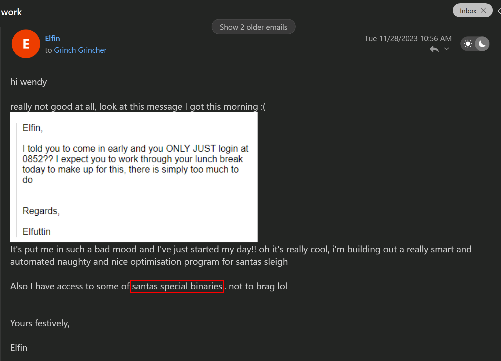

6. The threat actor changes their name, what is the new name + the date of the first email Elfin receives with it?

**Answer:** `Wendy Elflower, 2023-11-28 10:00:21`

The threat actor changes the name to `Wendy Elflower`:

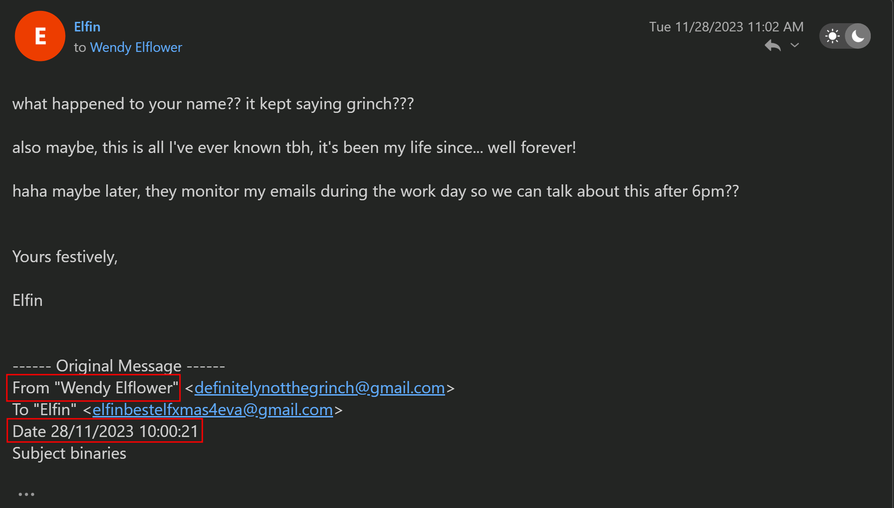

7. What is the name of the bar that Elfin offers to meet the threat actor at?

**Answer:** `SnowGlobe`

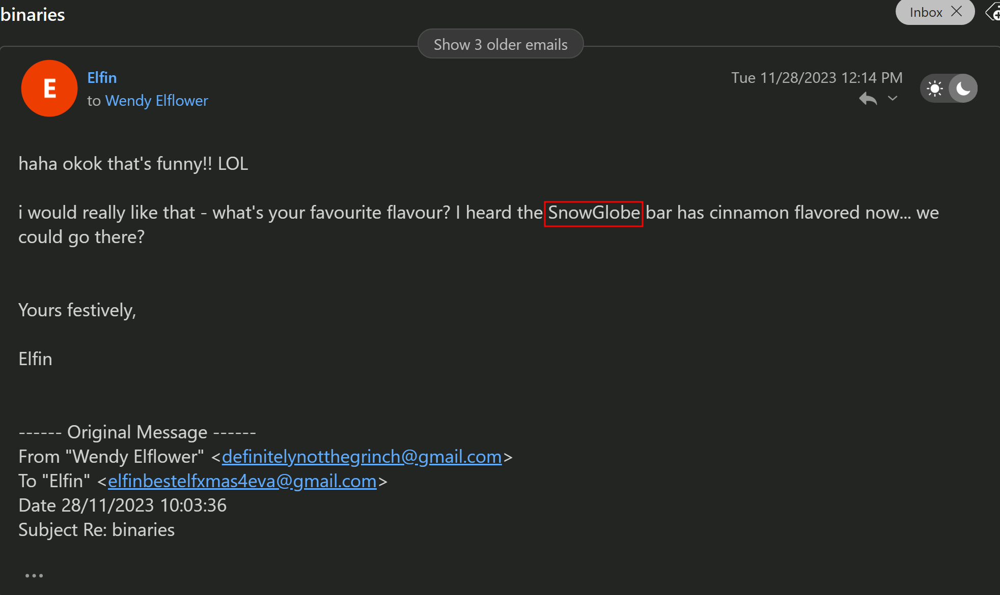

8. When does Elfin offer to send the secret files to the actor?

**Answer:** `2023-11-28 16:56:13`


In the `Sent` folder, in the email `can't wait any longer` the user offers the files:

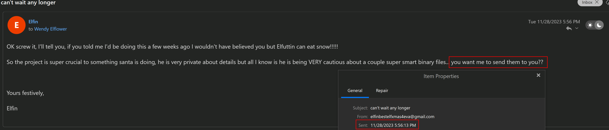

Time is UTC+01, therefore subtracting one is needed.

9. What is the search string for the first suspicious google search from Elfin? (Format: string)

**Answer:** `how to get around work security`

Loading the `HISTORY` file into a SQLite viewer, inside the `urls` table the google search is found:

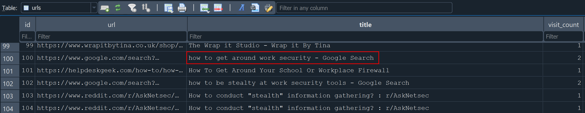

10. What is the name of the author who wrote the article from the CIA field manual?

**Answer:** `Joost Minnaar`

In the same table, flitering for `CIA` reveals the URL:

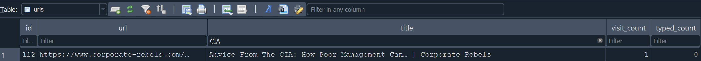

In the article, the author name is present:


11. What is the name of Santas secret file that Elfin sent to the actor?

**Answer:** `santa_deliveries.zip`

The email with no subject inside the `Sent` folder holds the file name:

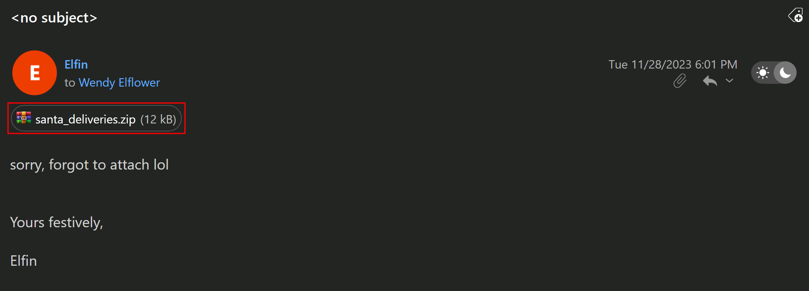

12. According to the filesystem, what is the exact CreationTime of the secret file on Elfins host?

**Answer:** `2023-11-28 17:01:29`

Parsing the `USN Journal`file:

```powershell
.\MFTECmd.exe -f "C:\ad\elfidence_collection\TriageData\C\`$Extend\`$J" --csv 'C:\ad\elfidence_collection\TriageData\' --csvf usnjournal.csv
```

Filtering for the file and `FileCreate` event shows the timestamp of creation:

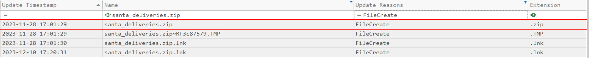

13. What is the full directory name that Elfin stored the file in?

**Answer:** `C:\users\Elfin\Appdata\Roaming\top-secret`

In he parent folder `Roaming` where the `eM Client` is installed, the folder `top-secret` is present:

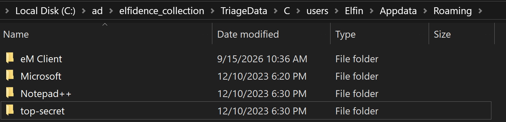

Inside said folder there is the stored file:

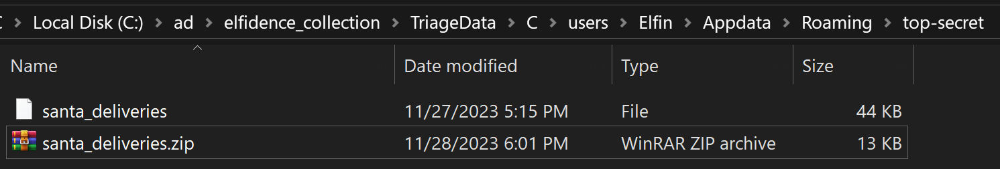


Alternatively, parsing the `MFT`:

```powershell
.\MFTECmd.exe -f "C:\ad\elfidence_collection\TriageData\C\`$MFT" --csv "C:\ad\elfidence_collection\TriageData\C\" --csvf "mft.csv"
```

Filtering for the `santa_deliveries.zip` file shows the full path:

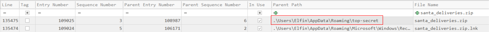

14. Which country is Elfin trying to flee to after he exfiltrates the file?

**Answer:** `Greece`

The `urls` table of the `History` database reveals the country:

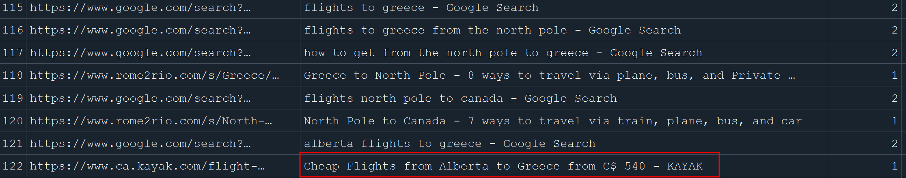

15. What is the email address of the apology letter the user (elfin) wrote out but didn’t send?

**Answer:** `santa.claus@gmail.com`

The email is present in the `Drafts` folder:

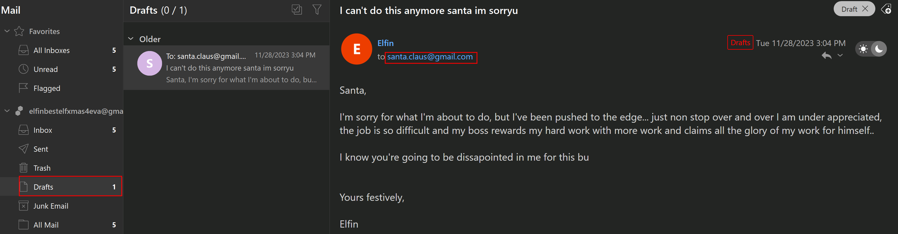


16. The head elf PixelPeppermint has requested any passwords of Elfins to assist in the investigation down the line. What’s the windows password of Elfin’s host?

**Answer:** `Santaknowskungfu`

The tool `secretdumps.py` from `Impacket` dumps the hashes from the `SAM` registry:

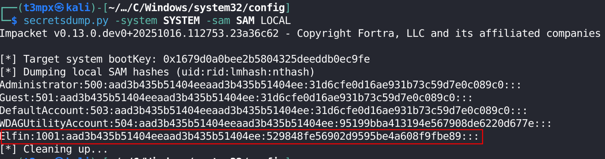


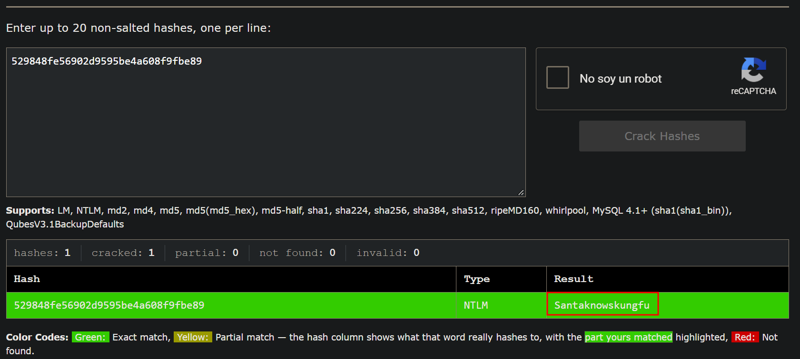