---
tags:
  - htb
  - sherlock
  - easy
  - post
urls:
---
---
# HTB Sherlock - Name Writeup

> **Scenario:** We've identified an unusual pattern in our network activity, indicating a possible security breach. Our team suspects an unauthorized intrusion into our systems, potentially compromising sensitive data. Your task is to investigate this incident.

# QUESTIONS

1. From what domain is the VBS script downloaded?

**Answer:** `escuelademarina.com`

Filtering for `dns` inside Wireshark shows two domains:

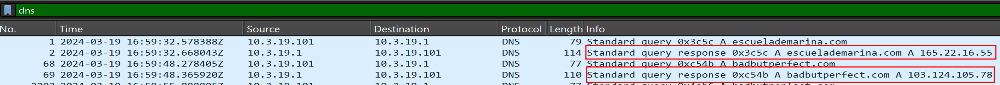

The IP `165.22.16.55` is used to communicate using `SMB`:

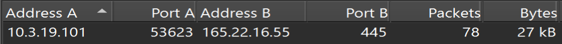

The `smb2.cmd == 5` filter is used to retrieve the `Open/Create` object, in this case a file:

```
ip.addr == 165.22.16.55 && smb2.cmd == 5 
```

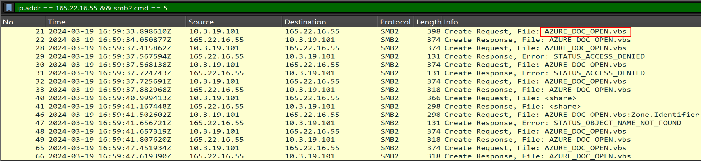

2. What was the IP address associated with the domain in question #1 used for this attack?

**Answer:** `165.22.16.55`

3. What is the filename of the VBS script used for initial access?

**Answer:** `AZURE_DOC_OPEN.vbs`

4. What was the URL used to get a PowerShell script?

**Answer: ** `badbutperfect.com/nrwncpwo`

Downloading the `VBS` script from the `SMB` export object list:

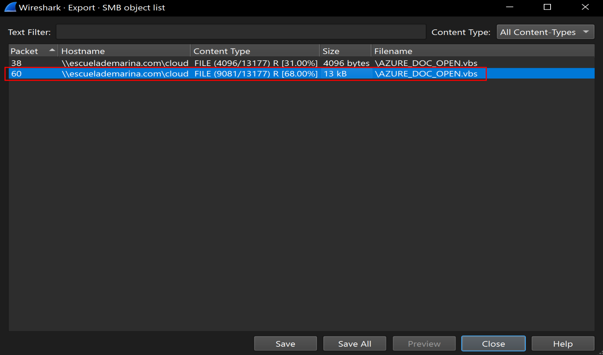

At the end of the script the download command is present:

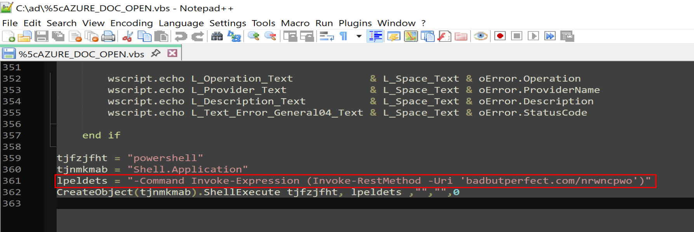

5. What likely legit binary was downloaded to the victim machine?

**Answer:** `autohotkey.exe`

Looking at the `GET` requests to the `badbutperfect.com` domain reveals 4 petitions:

```
http.host == "badbutperfect.com" && http.request.method == GET
```

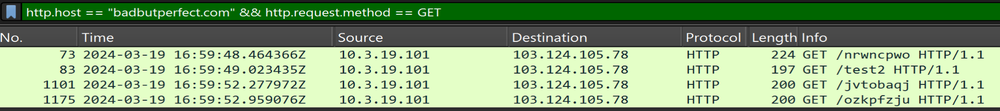

Following the `HTTP stream` of the first one shows the download and execution of the binary:

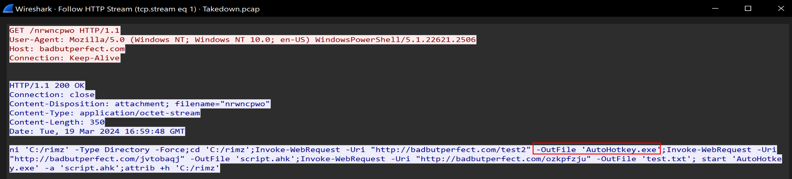

6. From what URL was the malware used with the binary from question #5 downloaded?

**Answer:** `http://badbutperfect.com/jvtobaqj`

In the same `HTTP stream`:

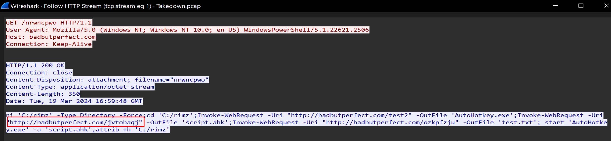

`AutoHotkey` uses `.ahk` files.

7. What filename was the malware from question #6 given on disk?

**Answer:** `script.ahk`

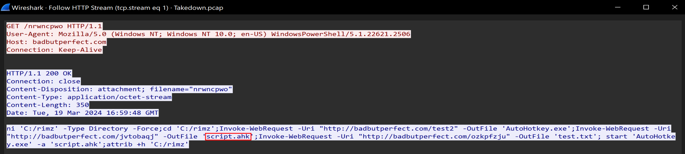

8. What is the TLSH of the malware?

**Answer:** `T15E430A36DBC5202AD8E3074270096562FE7DC0215B4B32659C9EF16835CF6FF9B6A1B8`

Downloading the file from the `HTTP` export menu using the URI name:

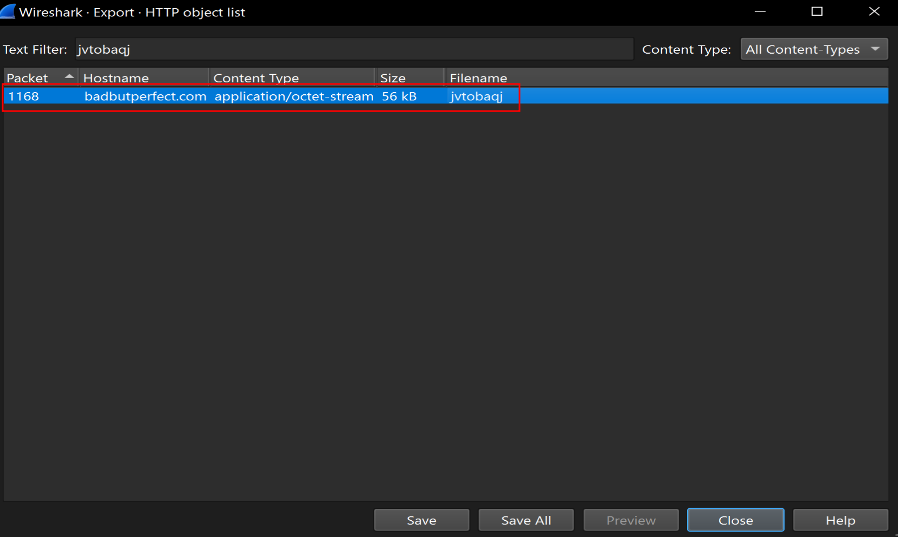

Then calculating the `TLSH` hash:

```bash
tlsh -f jvtobaqj
```

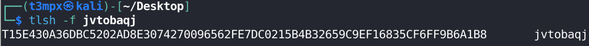

9. What is the name given to this malware? Use the name used by McAfee, Ikarus, and alejandro.sanchez.

**Answer:** `DarkGate`

A quick Google search returns the malware name:

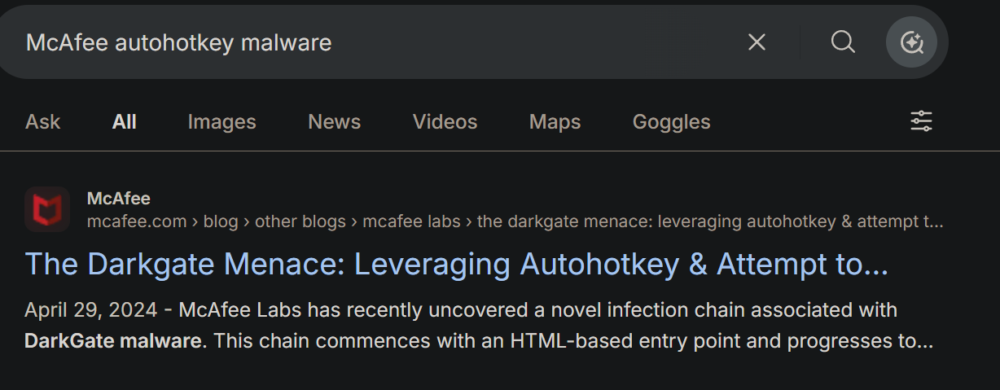

10. What is the user-agent string of the infected machine?

**Answer:** `Mozilla/5.0 (Windows NT 10.0; Win64; x64) AppleWebKit/537.36 (KHTML, like Gecko) Chrome/118.0.0.0 Safari/537.36`

After infecting the machine, the host starts making `POST` requests to the domain `badbutperfect.com`:

```
ip.src == 10.3.19.101 && http.host == "badbutperfect.com"
```

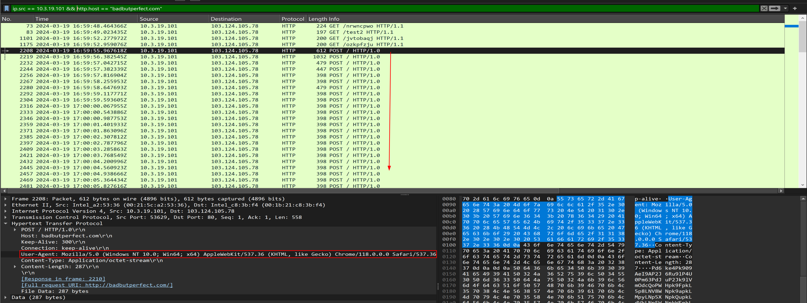

11. To what IP does the RAT from the previous question connect?

**Answer:** `103.124.105.78`

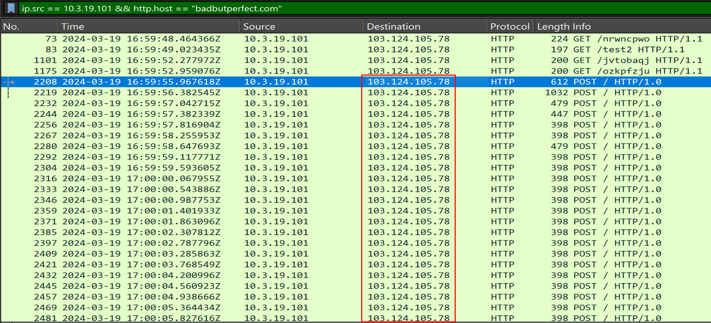