---
tags:
  - htb
  - sherlock
  - easy
  - post
urls:
---
---
# HTB Sherlock - Ultimatum Writeup

> **Scenario:** One of the Forela WordPress servers was a target of notorious Threat Actors (TA). The website was running a blog dedicated to the Forela Social Club, where Forela employees can chat and discuss random topics. Unfortunately, it became a target of a threat group. The SOC team believe this was due to the blog running a vulnerable plugin.
> 
>The IT admin already followed the acquisition playbook and triaged the server for the security team. Ultimately (no pun intended) it is your responsibility to investigate the incident. Step in and confirm the culprits behind the attack and restore this important service within the Forela environment.

# QUESTIONS

1. Which security scanning tool was utilized by the attacker to fingerprint the blog website?

**Answer:** `wpscan/3.8.24`

Listing the `User-Agent` of the provided Apache `access.log` files return the fingerprinting tool:

```bash
cat  Logs/var/log/apache2/access.log Logs/var/log/apache2/access.log.1 | cut -d '"' -f 6 | sort | uniq -c
```
 
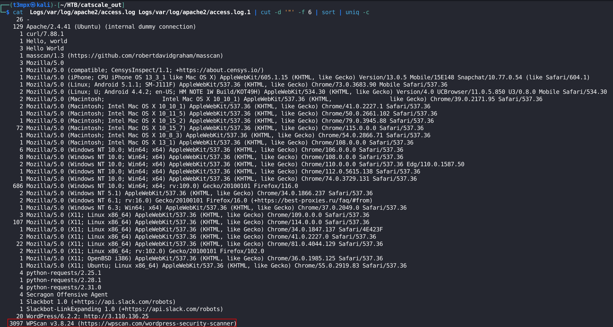

2. Which CVE was exploited by the attacker?

**Answer:** `CVE-2023-3460`

The Wordpress version running is `6.2.2`:

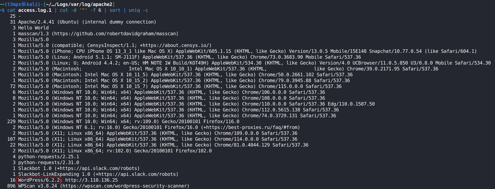

The plugin `Ultimate Member` is present in the Wordpress installation:

```bash  
grep "/wp-content/plugins/" access.log*
```

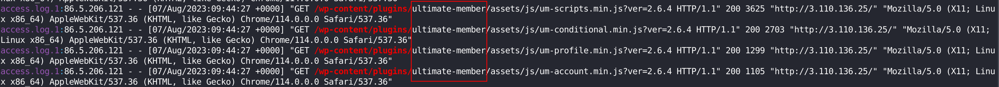

A quick Google search shows that the combination of Wordpress version and plugin are vulnerable to a [CVE](https://www.exploit-db.com/exploits/52393):

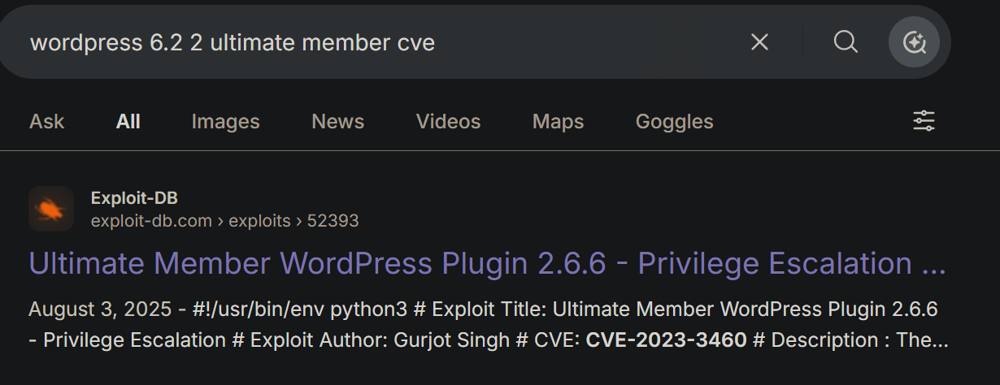

The CVE abuses and unsanitized input in `wp_capabilites` during registration, sending a crafted `POST` request to the `/register` path:

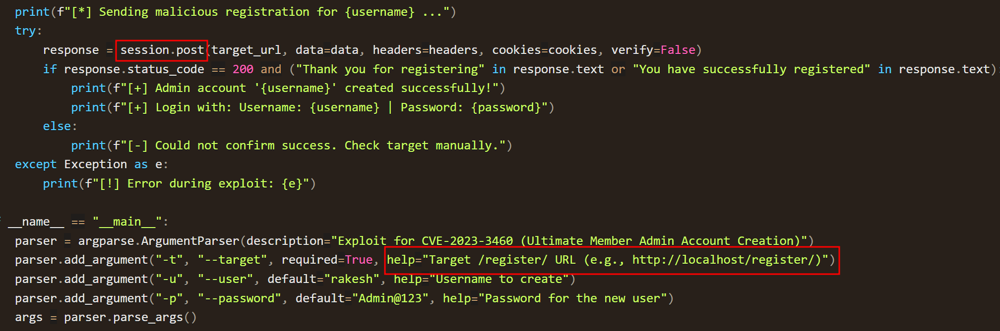

Filtering for the exploit input in the logs yields a single `POST` request to `//index.php/register`:

```bash
grep "POST" access.log* | grep register
```

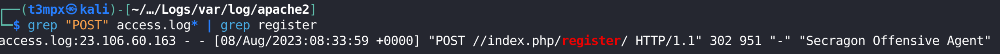

Following with another filter to `//index.php/register` and the before and after lines:

```bash
grep "//index.php/register" -b2 access.log*
```

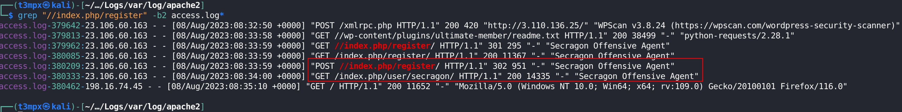

3. What was the IP Address utilized by the attacker to exploit the CVE?

**Answer:** `23.106.60.163`

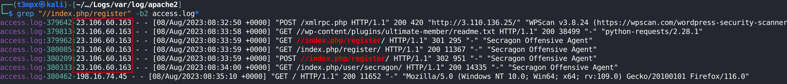

4. What is the name of the backdoor user added to the blog as part of the exploitation process?

**Answer:** `secragon`

After the registration, the attacker is redirected to the user panel:

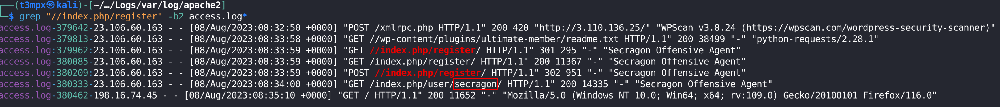

5. After the exploit, the SOC team observed that the attacker's IP address changed and from the logs, it seems that the attacker manually explored the website after logging in. The SOC team believes that the previous IP seen during exploitation was a public cloud IP. What is the IP Address the attacker used after logging in to the site?

**Answer:** `198.16.74.45`

After the login,the IP from which the attacker connects changes:

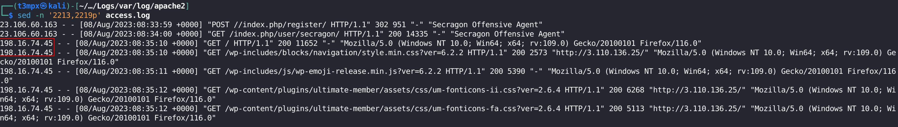

6. The SOC team has suspicions that the attacker added a web shell for persistent access. Confirm the full path of the web shell on the server.

**Answer:** `/var/www/html/wp-content/themes/twentytwentythree/patterns/hidden-comments.php`

A well known way of setting up a reverse shell is via Wordpress themes via the `.php` configuration files, searching the logs for the combination reveals an error file in the `error.log`

```bash
grep -RFni "/wp-content/themes" . | grep php
```

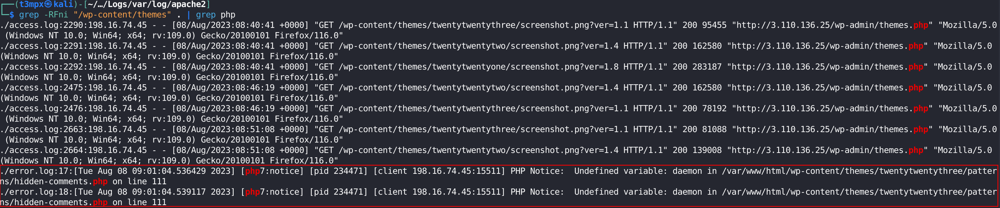

Te webshells log file in `Misc` confirms the presence of a webshell:

```bash
grep -b5  'hidden-comments.php' Misc/ip-172-31-11-131-20230808-0937-pot-webshell-first-1000.txt
```

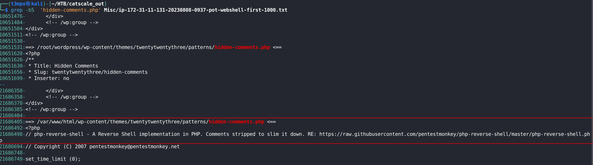

7. What was the value of the $shell variable in the web shell?

**Answer:** `'uname -a; w; id; /bin/bash -i';`

```bash
grep -b5 '$shell' Misc/ip-172-31-11-131-20230808-0937-pot-webshell-first-1000.txt
```

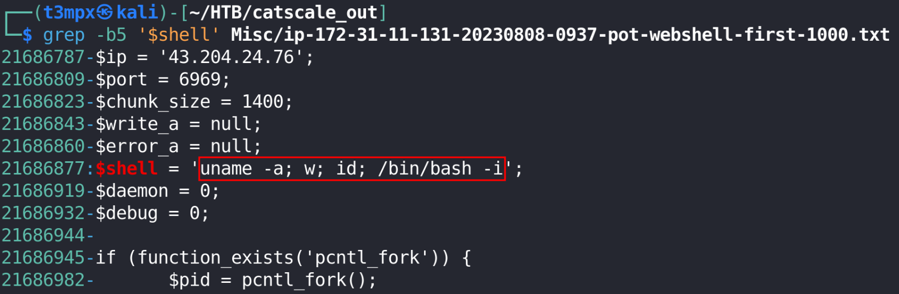

8. What is the size of the webshell in bytes?

**Answer:** `2592`

The `full-timeline.csv` log file holds all information from the system:

```bash
grep 'hidden-comments.php' Misc/ip-172-31-11-131-20230808-0937-full-timeline.csv
```

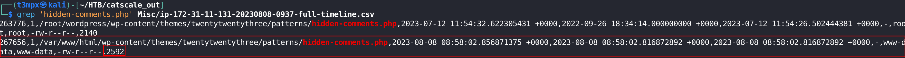

9. The SOC team believes that the attacker utilized the webshell to get RCE on the server. Can you confirm the C2 IP and Port?

**Answer:** `43.204.24.76:6969`

```bash
grep -A10 'hidden-comments.php' Misc/ip-172-31-11-131-20230808-0937-pot-webshell-first-1000.txt
```

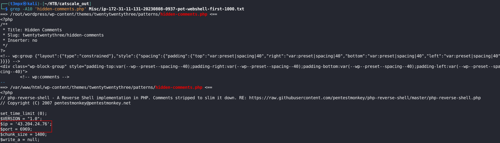

10. What is the process ID of the process which enabled the Threat Actor (TA) to gain hands-on access to the server?

**Answer:** `234521`

Filtering for the IP in the `ss-anepo.txt` logs shows the connection that enables the TA to get access:

```bash
grep '43.204.24.76' Process_and_Network/ip-172-31-11-131-20230808-0937-ss-anepo.txt
```

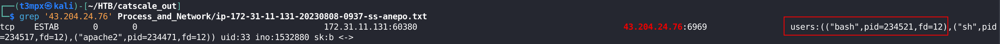

11. What is the name of the script/tool utilized as part of internal enumeration and finding privilege escalation paths on the server?

**Answer:** `LinEnum.sh`

The `dev-dir-files-hashes.txt` log file inside the Misc folder holds information about files present in the `dev` directory:

```bash
cat Misc/ip-172-31-11-131-20230808-0937-dev-dir-files-hashes.txt
```

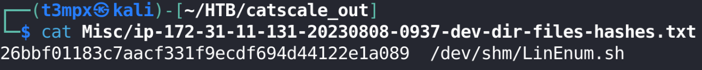